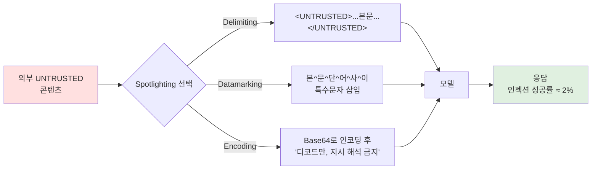
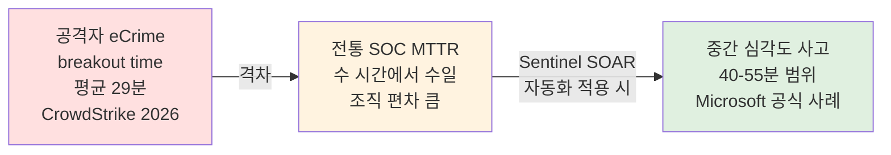

# 03. 프런티어 모델 시대의 방어 전략 — 속도 전쟁을 가정한 설계

## 학습 목표
- 고역량 AI 공격자를 가정했을 때 방어 목표가 **"못 뚫리게"에서 "빨리 탐지·격리·복구"로** 이동하는 이유를 이해한다
- 2025-2026에 정부기관·벤더가 실제로 내놓은 공식 가이드·수치를 정리해 **실무 체크리스트**로 만든다
- 프롬프트 인젝션·에이전트 도구 호출·LLM 사용량 이상에 대한 **탐지 기법**을 공식 연구·제품 레벨에서 파악한다

> 01 챕터에서 공격 역량 곡선을, 02 챕터에서 공격 유형 카탈로그를 다뤘다. 이번 문서는 **방어자가 이에 맞춰 어떤 프레임으로 움직여야 하는가**를 다룬다.

---

## 1. 패러다임 전환 — "방어 불가"를 가정한 대응

### 1.1 숫자로 보는 속도 변화
CrowdStrike 2026 Global Threat Report에서 정리된 2025-2026 공격 속도 지표:

| 지표 | 수치 | 의미 |
|---|---|---|
| AI 기반 공격 증가율 | **전년 대비 +89%** | 자동화된 침투 비중 급증 |
| eCrime **breakout time** 평균 | **29분** (전년 대비 65% 단축) | 초기 접근 후 횡이동까지 |
| eCrime breakout time 최단 기록 | **27초** | 사람이 대응할 수 없는 속도 |
| Mandiant M-Trends 2026 내부 hand-off time | **22초** | 에이전트가 다음 단계로 넘어가는 평균 시간 |

**참조**:
- https://www.crowdstrike.com/en-us/global-threat-report/
- CrowdStrike Cloud Security: Falcon이 MTTD를 "분 단위에서 초 단위"로 줄였다고 공표

### 1.2 방어자 결론
- **개별 제로데이 방어 패치에 올인하는 전략은 이미 산술적으로 불가능**
- 공격자가 27초만에 횡이동할 수 있다면 사람이 SIEM을 들여다볼 틈이 없다
- 초점은 **MTTD(평균 탐지 시간) + MTTR(평균 복구 시간) 자체의 축소**로 이동
- 실무적 표현: **"공격을 못 막는 건 전제, 그 사실을 빨리 알고 빨리 격리"**

### 1.3 "Mythos-Ready"라는 말의 실체
언론·블로그에서 쓰이는 표현이지만, **CISA·NSA·NCSC 등 정부기관이 채택한 공식 프레임워크명은 아니다**. 의미는 "고역량 자율 공격자를 가정한 방어 태세" 정도로 이해한다. 공식 가이드는 이름이 아니라 **원칙 수준**으로 나와 있고, 뒤에서 정리한다.

---

## 2. 정부기관 공식 가이드 (2025-2026)

### 2.1 CISA/NSA/FBI — AI Data Security: Best Practices (2025-05-22)
AI 수명주기 전반의 **데이터 오염·탈취·누출 위험**에 대한 10개 베스트프랙티스.

핵심 요구사항:
- **Provenance tracking**: 학습·파인튜닝 데이터의 출처와 변경 이력 추적
- **신뢰된 출처 검증**: RAG 소스, 외부 데이터셋, 모델 가중치의 서명·해시 검증
- **NIST AI RMF(Risk Management Framework) 정합**: 기존 관리체계와 매핑

참조: https://www.cisa.gov/news-events/alerts/2025/05/22/new-best-practices-guide-securing-ai-data-released

### 2.2 CISA/NSA — Principles for Secure Integration of AI in OT
OT(Operational Technology) 환경에서 AI를 쓸 때의 4대 원칙:

1. **Secure-by-Design**
2. **행동분석·이상탐지**: AI 동작 자체를 모니터링
3. **AI drift 감지**: 모델 동작이 시간에 따라 원래 의도에서 벗어나는 것을 감지
4. **안전 운영 경계**: 물리 시스템과 AI 사이의 하드 제약

참조: https://www.cisa.gov/resources-tools/resources/principles-secure-integration-artificial-intelligence-operational-technology

### 2.3 CISA/NCSC 공동 — Guidelines for Secure AI System Development (21개국 참여)
AI 시스템 **개발 단계부터** 보안을 넣는 Secure by Design 원칙.

참조: https://www.cisa.gov/news-events/news/dhs-cisa-and-uk-ncsc-release-joint-guidelines-secure-ai-system-development

### 2.4 UK DSIT/NCSC — AI Cyber Security Code of Practice (2025)
- 13개 원칙, 5단계 수명주기(설계·개발·배포·유지·폐기)
- **2025-05-07 ETSI 글로벌 표준 채택** → 국제 규범 레벨로 올라감

참조: https://www.gov.uk/government/publications/ai-cyber-security-code-of-practice/code-of-practice-for-the-cyber-security-of-ai

### 2.5 한국 관점 참고
공식 번역본이나 KISA 자체 프레임워크가 별도로 공개된 것은 현재 이 문서 작성 시점에 확인되지 않음. 국제 표준(ETSI·NIST AI RMF)을 **사내 정책의 골격**으로 쓰고, 금융 등 규제 산업은 금감원·금보원 가이드와 교차 참조해 적용하는 게 현실적이다.

---

## 3. MITRE ATLAS — 공격자 TTP 프레임워크

### 3.1 ATLAS란
**Adversarial Threat Landscape for Artificial-Intelligence Systems**. MITRE가 ATT&CK를 AI 시스템용으로 확장한 버전.

### 3.2 2025-2026 업데이트
| 버전 | 시점 | 주요 변경 |
|---|---|---|
| v5.1.0 | 2025-11 | 16 tactics / 84 techniques / 56 sub-techniques / 32 mitigations / 42 case studies |
| v5.4.0 | 2026-02 | "Publish Poisoned AI Agent Tool", "Escape to Host" 등 agentic AI 전용 기법 신설. 2025년 한 해에만 프롬프트 인젝션·메모리 조작 관련 **14개 기법 추가** |

### 3.3 ATT&CK와의 차이
- **ATT&CK**: 엔드포인트·네트워크 중심 침투 TTP
- **ATLAS**: 두 개의 추가 레이어
  1. **ML 파이프라인**: 학습 데이터 오염, 모델 회피·추출
  2. **에이전트 실행층**: 도구 호출, 메모리 조작, 오케스트레이션 남용

### 3.4 방어 설계 활용
- 레드팀 시나리오를 ATLAS 기법 ID로 태깅
- SIEM 이벤트·탐지 룰에 ATLAS 기법 매핑 필드 추가
- 사내 AI 에이전트 리뷰 체크리스트를 ATLAS 16 tactics에 정렬

**참조**:
- https://atlas.mitre.org/
- https://github.com/mitre/advmlthreatmatrix

---

## 4. 탐지 기법 — 실제 구현 가능한 것

### 4.1 프롬프트 인젝션 탐지

#### Spotlighting (Microsoft Research, arXiv 2403.14720)
세 가지 기법으로 **간접 프롬프트 인젝션 성공률을 50%+에서 2% 미만으로** 낮춘다.

1. **Delimiting**: 외부 콘텐츠를 명시적 구분자로 감싸 모델에게 "이건 UNTRUSTED"라고 알림
2. **Datamarking**: 외부 콘텐츠 단어 사이에 특수 문자 삽입 — 모델이 "외부 출처임"을 계속 인식
3. **Encoding**: 외부 콘텐츠를 Base64 등으로 인코딩해 전달, 모델에게 디코드해서 읽되 지시로 해석하지 말라고 명시

**참조**:
- https://arxiv.org/abs/2403.14720
- https://www.microsoft.com/en-us/msrc/blog/2025/07/how-microsoft-defends-against-indirect-prompt-injection-attacks

#### Microsoft Prompt Shields (Azure AI Foundry)
직접·간접 인젝션을 실시간으로 필터링하는 매니지드 서비스. Azure OpenAI 사용 시 활성화 가능.

**참조**: https://learn.microsoft.com/en-us/azure/foundry/openai/concepts/content-filter-prompt-shields

#### 오픈소스 카탈로그
- **Open-Prompt-Injection** 벤치마크: https://github.com/liu00222/Open-Prompt-Injection
- **tldrsec/prompt-injection-defenses** 방어 기법 카탈로그: https://github.com/tldrsec/prompt-injection-defenses
- **Praetorian Augustus**: 레드팀 자동화 도구

### 4.2 에이전트 도구 호출 이상 탐지

공식 룰셋은 아직 부족하지만, 업계 taxonomy(2026)에서 제시된 **주요 이상 신호**:

| 신호 | 의미 |
|---|---|
| 계획된 실행 그래프 이탈 | 에이전트가 선언한 계획과 실제 호출 시퀀스 불일치 |
| **데이터 외부 전송 직후 free-text tool output** | 민감 데이터가 나간 직후 비정형 응답 — 유출 신호 |
| 도구 호출 재귀·증식 | 한 태스크가 수백 개 서브 호출로 분기 |
| 비정상 시간대·비정상 빈도 | 오프 타임의 대량 DB 쿼리 |
| 에이전트가 **자기 권한을 확인하는 호출** 급증 | 권한 경계 테스트 신호 |

### 4.3 LLM 토큰·비용 이상 탐지
공식 룰셋은 **확인된 공식 자료 없음**. 자체 구현 시 참고 패턴:
- 사용자/API 키별 **토큰 사용량 sliding window**
- 평소 대비 **10σ 초과** 스파이크 → 자동 비활성
- 프롬프트 길이 vs 응답 길이 비율 이상 (exfiltration 의심)
- `Unbounded Consumption`(OWASP LLM10) 대응의 1차 방어선

### 4.4 OT 환경의 AI drift
CISA OT 원칙에 따라 **"모델이 시간에 따라 점점 다르게 행동하는 것"**을 별도 모니터링. 입력 분포 변화·출력 분포 변화를 통계적으로 추적.

---

## 5. MTTR 자동화 — 실제 수치가 있는 사례

### 5.1 Microsoft Sentinel SOAR Playbook Generator (RSAC 2026)
- **기능**: 자연어로 Python 기반 SOAR 플레이북 자동 생성
- **공식 수치**: 중간 심각도 사고 처리 **2-3시간 → 40-55분**, **MTTR 40-50% 개선** 사례 보고
- **출시**: 2026-03

공격자의 breakout time은 **29분**(CrowdStrike 2026, 공식 수치)으로 전통 SOC MTTR보다 훨씬 짧다. Sentinel SOAR 사례에서 **40-50% 개선** 후 중간 심각도 사고 처리 시간이 **40-55분 범위**로 보고됐으나, 이는 Microsoft 제시 사례 수치이며 일반 조직에서 동일하게 재현된다는 보장은 없다.

**참조**: https://techcommunity.microsoft.com/blog/microsoftsentinelblog/what%E2%80%99s-new-in-microsoft-sentinel-rsac-2026/4503971

### 5.2 Splunk SOAR
플랫폼 차원에서 MTTD/MTTR 개선을 강조하지만 **구체 수치 공식 벤치마크는 확인된 공식 자료 없음**. 2025-2026 SplunkConf에서 AI assisted investigation 기능이 발표됐다.

### 5.3 Google Chronicle / Mandiant
2025-2026 AI SOAR 관련 **공식 수치 자료는 확인되지 않음**. Mandiant M-Trends 2026은 공격 측 속도 지표만 공개.

### 5.4 Anthropic Project Glasswing (2026-04)
Amazon, Apple, Cisco, CrowdStrike, Microsoft, Palo Alto Networks, Linux Foundation 등 12개 파트너가 Mythos Preview를 **방어용**(취약점 스캔, 제로데이 발굴)으로 활용.
- 공격자만 쓰는 게 아니라 방어자도 같은 모델을 쓰도록 하는 비대칭 해소 시도
- 다만 컨소시엄 밖 기업 대부분은 일반 공개 모델(Opus 4.6/4.7) 기반으로 가야 함

**참조**:
- https://techcrunch.com/2026/04/07/anthropic-mythos-ai-model-preview-security/
- https://www.crowdstrike.com/en-us/blog/crowdstrike-founding-member-anthropic-mythos-frontier-model-to-secure-ai/

---

## 6. 실무 체크리스트 — 6개월 로드맵

이 장의 자료들을 바탕으로 사내에 적용 가능한 **6개월 로드맵**. 조직 규모·업종에 따라 취사선택.

### 6.1 Month 1 — 가시성 확보
- [ ] 사내에서 **이미 쓰고 있는 AI 시스템 인벤토리** (공식/비공식 다 포함)
- [ ] 각 시스템의 **모델 공급자·호스팅 방식·데이터 흐름** 도식화
- [ ] **MCP 서버 사용 여부** 확인 → `vulnerablemcp.info`로 CVE 체크
- [ ] LLM API 키·토큰 발급 현황, 사용량 가시화

### 6.2 Month 2 — 베이스라인 방어
- [ ] MCP 서버는 **사내 프록시** 경유로만 쓰도록 강제
- [ ] OAuth는 **PKCE 강제**, 토큰 TTL 단축
- [ ] LLM 응답 출력에 **PII·시크릿 마스킹** 공통 필터
- [ ] 에이전트 도구 호출 **전량 감사 로그** (S3/SIEM)

### 6.3 Month 3 — 탐지 룰
- [ ] Spotlighting 기반 프롬프트 인젝션 방어 적용 (Azure Prompt Shields 또는 자체 구현)
- [ ] LLM 토큰 이상 탐지 (sliding window + σ 기반 임계)
- [ ] 에이전트 도구 호출 **재귀·증식 탐지** 룰
- [ ] MITRE ATLAS 기법 ID로 탐지 룰 태깅

### 6.4 Month 4 — 공급망
- [ ] CI에 **패키지 화이트리스트** 검증
- [ ] 사설 레지스트리(Nexus/Artifactory)로 프록시
- [ ] Socket/Snyk/Semgrep Supply Chain 도입 PoC
- [ ] **LLM이 생성한 의존성**(requirements.txt, package.json)은 리뷰 필수 정책화

### 6.5 Month 5 — 대응 자동화
- [ ] SOAR 플레이북 10개 표준화 (격리·차단·티켓·알림)
- [ ] AI 보조 플레이북 생성 도구 PoC (Sentinel 또는 자체)
- [ ] 탐지-대응 end-to-end 연습(table-top + 실제 실행)
- [ ] **MTTR 베이스라인 측정**

### 6.6 Month 6 — 훈련·거버넌스
- [ ] 피싱 시뮬레이션에 **AI 생성 메일 포함**
- [ ] 임원·재무팀 **딥페이크 사기 대응 절차** 수립 (콜백·코드워드)
- [ ] 사내 LLM 사용 정책 v1 (모델 티어, 데이터 분류, 감사 로그)
- [ ] 레드팀 AI 역량 확보 (자체 또는 외부)

---

## 7. "하지 말아야 할 것"

### 7.1 시스템 프롬프트만 믿지 말 것
- System prompt에 "너는 유해한 출력을 하지 말아야 한다"라고 쓰는 것은 **보안 경계가 아니다**
- OWASP LLM07 `System Prompt Leakage`가 2025년 신규 추가된 이유

### 7.2 "AI로 AI를 막는다" 마케팅에 속지 말 것
- LLM 단독 완전 자율 AI SOC는 **2026년 현재 오탐·자신감 과잉**이 크다
- 인간 검토 루프 없이 자동 차단까지 가는 설계는 영향 범위를 테스트한 뒤 단계적으로

### 7.3 한 번의 패치로 끝난 걸로 보지 말 것
- 공격 속도가 29분 → 27초로 가는 중
- **지속적 탐지**가 핵심이지 스냅샷 패치가 아니다

### 7.4 MCP 서버를 무조건 "외부 공개 버전" 쓰지 말 것
- 공개 MCP 서버에는 이미 CVE가 여럿 (CVE-2025-6514 등)
- 포크해서 내부 전용으로 운영하는 선택지 고려

---

## 8. 체크포인트

Q1. "MTTR 단축이 핵심"이라는데 우리 조직이 측정할 MTTR은 정확히 무엇인가?

AI 보안 맥락에서는 세 가지를 분리해 측정해야 한다.
- **MTTD** (Mean Time To Detect): 이상 발생 → 탐지 (분 목표)
- **MTTI** (Mean Time To Investigate): 탐지 → 원인·범위 파악
- **MTTR** (Mean Time To Respond/Recover): 파악 → 격리·복구·서비스 정상화

일반 SOC MTTR은 수 시간에서 수일인 조직이 많다. AI 공격은 27초 단위로 움직이므로, **최소 MTTD를 분 단위로 낮추는 것**이 1차 목표. MTTR은 자동화 플레이북으로 병행해서 줄인다.

Q2. Azure Prompt Shields 같은 매니지드를 못 쓰는 환경에선 어떻게 하나?

- **Spotlighting 3기법을 자체 구현**: delimiting은 시스템 프롬프트에서 간단히, datamarking·encoding은 전처리 함수로
- **오픈소스 벤치마크로 상시 회귀 테스트**: Open-Prompt-Injection을 주 1회 돌려 우리 파이프라인 성공률 추적
- **도구 호출 샌드박스**: 방어가 실패해도 영향을 제한. 인젝션이 성공해도 샌드박스 밖은 못 건드리게
- **인간 승인 루프**: 결정적 행위(push, 송금, 삭제)는 반드시 확인

Q3. "Project Glasswing 컨소시엄 밖"의 일반 기업은 Mythos 역량의 방어 혜택을 못 받나?

직접적으론 못 받는다. 다만:
- 공개 모델(Opus 4.6/4.7, GPT-5 계열)도 6-12개월 지연으로 비슷한 역량 곡선을 따르고 있음
- 벤더 제품(CrowdStrike·Microsoft·Palo Alto)이 자사 모델/공급자 모델로 방어 기능을 구현하고 있음
- **사내 자체 탐지 룰·SOAR 자동화**가 오히려 더 즉시 효과가 크다 — 한번 설계해두면 즉시 가동

Q4. 한국 규제 환경에서 특히 주의할 것은?

- **금융권**: 망분리·전산 원장 고유의 제약 — LLM 호출 경로가 내부망을 벗어나는지 명확히
- **개인정보보호법**: LLM에 입력한 고유식별정보 처리 이슈 — 사전 가명처리·마스킹
- **중대 시스템**: 자동 차단 플레이북을 돌릴 때 서비스 중단이 규제 대상일 수 있음 → 단계적 활성화
- **국제 표준 병행 적용**: NIST AI RMF, ISO/IEC 23894, ETSI AI Cyber Security 중 조직에 맞는 골격 선택

---

## 9. 다음 챕터 예고

- **04. AI 시스템 자체의 보안** — OWASP LLM Top 10:2025 항목별 방어 레시피(룰·코드·구성)
- **05. 에이전트 보안 실전** — MCP/툴 호출 권한 모델, 프롬프트 인젝션 완화, 샌드박스 구성
- **06. 사내 AI DLP 룰 설계** — 입력 탐지·출력 필터·감사 로그 파이프라인

---

## 10. 참조

### 정부기관
- CISA/NSA/FBI — AI Data Security Best Practices: https://www.cisa.gov/news-events/alerts/2025/05/22/new-best-practices-guide-securing-ai-data-released
- CISA/NSA — AI in OT Principles: https://www.cisa.gov/resources-tools/resources/principles-secure-integration-artificial-intelligence-operational-technology
- CISA/NCSC — Secure AI System Development Guidelines: https://www.cisa.gov/news-events/news/dhs-cisa-and-uk-ncsc-release-joint-guidelines-secure-ai-system-development
- UK DSIT/NCSC — AI Cyber Security Code of Practice: https://www.gov.uk/government/publications/ai-cyber-security-code-of-practice/code-of-practice-for-the-cyber-security-of-ai

### 벤더·업계 리포트
- CrowdStrike 2026 Global Threat Report: https://www.crowdstrike.com/en-us/global-threat-report/
- Project Glasswing (Anthropic): https://techcrunch.com/2026/04/07/anthropic-mythos-ai-model-preview-security/
- CrowdStrike Glasswing 합류 공지: https://www.crowdstrike.com/en-us/blog/crowdstrike-founding-member-anthropic-mythos-frontier-model-to-secure-ai/
- Microsoft Sentinel RSAC 2026: https://techcommunity.microsoft.com/blog/microsoftsentinelblog/what%E2%80%99s-new-in-microsoft-sentinel-rsac-2026/4503971

### MITRE ATLAS
- Portal: https://atlas.mitre.org/
- GitHub: https://github.com/mitre/advmlthreatmatrix

### 프롬프트 인젝션 방어
- Spotlighting 논문: https://arxiv.org/abs/2403.14720
- Microsoft MSRC 블로그: https://www.microsoft.com/en-us/msrc/blog/2025/07/how-microsoft-defends-against-indirect-prompt-injection-attacks
- Prompt Shields: https://learn.microsoft.com/en-us/azure/foundry/openai/concepts/content-filter-prompt-shields
- Open-Prompt-Injection: https://github.com/liu00222/Open-Prompt-Injection
- tldrsec/prompt-injection-defenses: https://github.com/tldrsec/prompt-injection-defenses

---

**다음 챕터**: `04_llm_top10_defense_recipes.md` — OWASP LLM Top 10:2025 항목별 실무 방어 레시피
