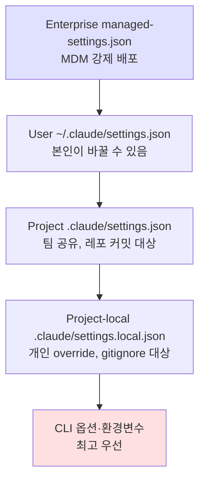
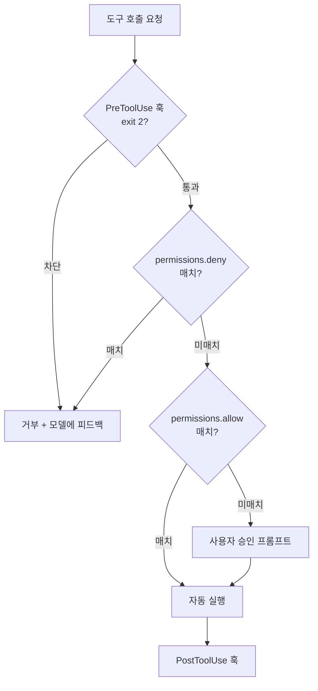

# 06. Claude Code CLI 실전 — 보안 관점

> **대상 독자**: 00-05 챕터를 읽은 뒤, Claude Code CLI를 **사내에서 안전하게 쓰게 하거나 직접 통제 포인트를 설계**해야 하는 보안 담당자.
> **목표**: CLI의 구조·권한 모델·훅(Hook)·MCP 연결·설정 파일을 정확히 이해하고, 사고가 터지기 전에 끼워넣을 수 있는 관측·차단 지점을 숙지한다.
> **다루지 않는 것**: Claude Desktop(GUI) 전용 기능, 비공식 래퍼, 모델 학습 이론.

---

## 0. 왜 CLI를 보안 담당자가 직접 다뤄야 하나

Claude Code는 **개발자 개인 맥북에서 sudo에 준하는 권한**으로 동작한다. 파일을 읽고, 쓰고, 명령을 실행하고, 브라우저를 열고, MCP 서버를 통해 사내 시스템에 접근한다. 즉 이건 IDE 확장 기능이 아니라 **"AI가 운영하는 워크스테이션 계정"** 이다.

보안 담당자 관점에서 세 가지만 먼저 기억한다:

1. **허가 모델은 런타임에 있다** — 모델은 요청만 하고, CLI 런타임이 실제 실행 여부를 판단한다. 즉 통제의 자리는 CLI.
2. **세 계층의 설정이 존재한다** — 유저 전역 / 프로젝트 / 프로젝트 로컬. 셋의 우선순위와 어디에 뭐가 들어가는지 모르면 통제 못 한다.
3. **훅(Hook)은 무료 공짜 보안 게이트** — 프리/프로/팀 플랜 관계없이 동작하는 **사용자 측 강제력**이다. DLP·차단·감사 로깅을 여기에 건다.

---

## 1. 설치·인증·첫 실행 — 보안 관점 체크

### 1.1 설치

공식 설치 방식 (2026-04 기준):

```bash
# macOS / Linux
curl -fsSL https://claude.ai/install.sh | bash

# npm 경유 (개발자 환경에 이미 node가 있으면)
npm install -g @anthropic-ai/claude-code
```

확인:
```bash
claude --version
which claude
```

**보안 담당자가 즉시 체크할 것:**
- 설치 경로가 `/usr/local/bin`인지, 홈 디렉터리인지 (권한 관리 차이)
- `curl | bash` 방식 설치 스크립트는 **사내 정책상 금지일 수 있음** — 설치 스크립트 내려받아 검토 후 실행하도록 가이드
- 자동 업데이트 동작 여부 — 업데이트로 훅 동작이 깨지면 통제 공백 발생

### 1.2 인증

Claude Code는 세 가지 인증 경로 중 하나를 쓴다:

| 방식 | 데이터 보존 | 권장 용도 |
|---|---|---|
| Anthropic Console 계정 로그인 (OAuth) | 조직 설정 따름 | Pro/Team/Enterprise 플랜 사용자 |
| Anthropic API 키 (`ANTHROPIC_API_KEY`) | 기본 30일 | 개인 실험·CI 자동화 |
| 사내 게이트웨이 경유 (`ANTHROPIC_BASE_URL`) | 게이트웨이 정책 따름 | 사내 DLP·감사 강제 |

**Enterprise 환경에서의 권장 구성:**
- `ANTHROPIC_BASE_URL`을 사내 게이트웨이로 강제
- 각 사용자는 게이트웨이용 토큰을 발급받아 로컬 환경변수에 둠
- 게이트웨이가 사용자·부서 단위 쿼터·감사 로그·DLP를 일괄 처리

### 1.3 첫 실행 시 자동 생성되는 것

CLI를 처음 실행하면 다음이 만들어진다:

```
~/.claude/
├── settings.json             # 유저 전역 설정
├── claude.db                 # 세션·로그 SQLite
├── projects/
│   └── <프로젝트별-슬러그>/  # 대화 로그, 메모리, 요약
└── ... (내부 캐시)
```

**보안 관점:**
- `~/.claude/` 전체를 **사내 보안 백업 대상**으로 분류할지 결정 — 대화 이력에 민감 코드·토큰 흔적이 남을 수 있다.
- 반대로 **외부 전송 차단 대상**이기도 하다. 이 경로가 퇴직자 맥북에 남는 건 리스크.
- `.gitignore`에 `.claude/`를 반드시 넣는다 (자세한 건 1.5 참고).

### 1.4 첫 실행 스모크 테스트

```bash
cd ~/my-project
claude
# 프롬프트 창에서:
> 현재 디렉터리 파일 목록을 보여줘
```

관찰할 것:
- CLI가 `ls` 또는 `Glob` 툴을 실행하려 할 때 **권한 승인 프롬프트**가 뜬다
- 승인/거부/매번 확인 옵션을 선택하면 → 해당 결정이 **settings.json에 저장됨**
- 이 저장된 승인 목록이 이후 세션에 자동 상속된다

### 1.5 프로젝트에 반드시 넣어야 하는 .gitignore 항목

```
# Claude Code 로컬 상태
.claude/
CLAUDE.md              # 로컬 전용 컨텍스트 파일 (팀 공유용은 별도 규약)
.claude/settings.local.json
```

**주의**: 팀에서 공용으로 공유할 `CLAUDE.md`는 커밋해도 된다. 개인 메모·비밀이 들어있는 버전은 `.claude/` 내부나 `CLAUDE.local.md` 같은 별도 파일에 분리한다.

---

## 2. 설정 파일 3계층 — 우선순위와 통제 포인트

### 2.1 계층 구조



**핵심 원칙:**
- **Enterprise 관리 설정**(MDM으로 배포)은 **사용자가 바꿀 수 없다** — 사내 표준 DLP·금지 명령을 여기에 박는다
- **프로젝트 settings.json**은 팀 전체에 공유 — 프로젝트별 훅·허용 도구를 정의
- **settings.local.json**은 개인 예외 — 반드시 `.gitignore`
- CLI 옵션과 환경변수가 최종 우선권 — 스크립트 자동화 시 오버라이드 가능

### 2.2 settings.json 주요 필드 (보안 관점)

```jsonc
{
  // 모델 기본값 — 전사 표준 모델을 여기 박으면 부서별 무단 이탈 방지
  "model": "claude-sonnet-4-6",

  // 훅 — 이벤트별로 임의 스크립트 실행
  "hooks": {
    "PreToolUse":  [ /* 도구 실행 전 검사 */ ],
    "PostToolUse": [ /* 도구 실행 후 로깅 */ ],
    "UserPromptSubmit": [ /* 사용자 입력 DLP */ ],
    "Stop": [ /* 세션 종료 시 */ ]
  },

  // 권한 — 자동 허용/거부 목록
  "permissions": {
    "allow": [
      "Bash(npm test)",
      "Bash(git status)",
      "Read(**)"
    ],
    "deny": [
      "Bash(rm -rf *)",
      "Bash(curl *)",
      "Write(/etc/**)"
    ]
  },

  // 환경변수 — 게이트웨이 강제
  "env": {
    "ANTHROPIC_BASE_URL": "https://llm-gw.internal.company.com"
  },

  // MCP 서버 선언
  "mcpServers": { /* 2.4 참고 */ }
}
```

### 2.3 Enterprise managed-settings.json

Anthropic은 MDM을 통한 **강제 설정 배포**를 공식 지원한다.

배포 경로 (플랫폼별, 공식 문서 기준):
- macOS: `/Library/Application Support/ClaudeCode/managed-settings.json`
  - MDM 경로는 `com.anthropic.claudecode` managed preferences 도메인 (Jamf·Kandji 등)
- Linux / WSL: `/etc/claude-code/managed-settings.json`
- Windows: `C:\Program Files\ClaudeCode\managed-settings.json`
  - 레지스트리 경로는 `HKLM\SOFTWARE\Policies\ClaudeCode`의 `Settings` 값 (GPO·Intune)
  - ※ 구 경로 `C:\ProgramData\ClaudeCode\managed-settings.json`는 v2.1.75 이후 지원 중단, 마이그레이션 필요

같은 디렉터리에 `managed-settings.d/` 드롭인 디렉터리를 두고 정책 파편을 분할 배포할 수도 있다(알파벳 순 병합). 또한 Anthropic은 콘솔 서버에서 내려주는 **server-managed settings**도 별도로 제공한다.

이 파일에 `permissions.deny`, 훅, 환경변수를 박으면 **사용자가 개인 settings.json에서 이를 풀 수 없다**.

**사내 권장 최소 강제안:**
```jsonc
{
  "env": {
    "ANTHROPIC_BASE_URL": "https://llm-gw.internal.company.com"
  },
  "permissions": {
    "deny": [
      "Bash(rm -rf /*)",
      "Bash(curl http://169.254.169.254/*)",   // 클라우드 메타데이터 SSRF 방지
      "Bash(*wget*)",                          // 외부 다운로드 금지
      "WebFetch(http://169.254.*)"
    ]
  },
  "hooks": {
    "UserPromptSubmit": [{ "command": "/opt/corp-sec/claude-prompt-dlp" }],
    "PreToolUse": [{ "command": "/opt/corp-sec/claude-tool-audit" }]
  }
}
```

### 2.4 MCP 서버 선언 예

```jsonc
{
  "mcpServers": {
    "github": {
      "command": "npx",
      "args": ["-y", "@modelcontextprotocol/server-github"],
      "env": { "GITHUB_TOKEN": "${GITHUB_TOKEN}" }
    }
  }
}
```

**보안 관점 체크:**
- MCP 서버가 `npx -y`로 **임의 패키지**를 받아 실행하는 구조 — 패키지 이름 스쿼팅·손상된 배포 시 바로 RCE
- 따라서 사내에서는 **레지스트리 고정·해시 고정 또는 미러 레지스트리** 권장
- MCP 서버 자체에 관한 공격면은 05 챕터 참조

---

## 3. Hook(훅) — 실전 통제의 핵심

Claude Code의 훅은 특정 이벤트가 발생할 때마다 **임의의 쉘 명령**을 실행시키는 사용자 측 후크다. 2026-04 공식 문서(`https://code.claude.com/docs/en/hooks`) 기준 지원 이벤트는 다음과 같다.

| 이벤트명 | 발생 시점 | 보안 용도 |
|---|---|---|
| `SessionStart` | 세션이 시작/재개될 때 | 사용자·호스트·모델 ID 기록 |
| `InstructionsLoaded` | `CLAUDE.md`·`.claude/rules/*.md`가 컨텍스트에 로드될 때 | 로컬 지시문 변조 감지 |
| `ConfigChange` | 세션 중 설정 파일 변경 | 훅·권한 변경 감사 |
| `CwdChanged` | 작업 디렉터리 변경 | 경로 이탈 감지 |
| `FileChanged` | 감시 중 파일이 디스크에서 변경됨 | 외부 변조 감지 |
| `UserPromptSubmit` | 사용자가 프롬프트를 제출한 직후 | 입력 DLP, 금지어 차단 |
| `PreToolUse` | 도구 호출 직전 (차단 가능) | 인자 검증, 허용 목록 재확인 |
| `PermissionRequest` | 권한 다이얼로그가 뜰 때 | 사용자 승인 패턴 기록 |
| `PermissionDenied` | auto 모드 분류기가 호출을 거부할 때 | 거부 로그 |
| `PostToolUse` | 도구 호출이 성공으로 끝났을 때 | 결과 감사, 누출 스캔 |
| `PostToolUseFailure` | 도구 호출이 실패했을 때 | 실패 패턴 분석 |
| `Notification` | CLI가 알림을 띄울 때 | 이벤트 기록 |
| `SubagentStart` | 서브에이전트 생성 시 | 위임 감사 |
| `SubagentStop` | 서브에이전트 종료 시 | 결과·토큰 집계 |
| `TaskCreated` / `TaskCompleted` | `TaskCreate` 사이클 | 태스크 단위 감사 |
| `Stop` | Claude 턴 종료 | 세션 단위 집계 |
| `StopFailure` | API 오류로 턴 종료 | 실패 원인 기록 |
| `TeammateIdle` | 에이전트 팀 동료가 유휴로 전환될 때 | 다중 에이전트 감사 |
| `WorktreeCreate` / `WorktreeRemove` | `--worktree`·isolation worktree 이벤트 | 격리 워크트리 추적 |
| `PreCompact` / `PostCompact` | 컨텍스트 압축 전·후 | 원본 스냅샷 저장 |
| `Elicitation` / `ElicitationResult` | MCP 서버가 사용자 입력을 요청할 때·응답 시 | MCP 입력 로깅 |

※ 이벤트 집합은 버전에 따라 변할 수 있다. 프로덕션 전 반드시 `https://code.claude.com/docs/en/hooks` 최신본 재확인.

### 3.1 훅 작성 기본 형식

```jsonc
{
  "hooks": {
    "PreToolUse": [
      {
        "matcher": "Bash",                    // 특정 도구만 필터
        "command": "/usr/local/bin/hook-pretool",
        "timeout": 5000                        // ms, 초과시 실패
      }
    ]
  }
}
```

훅 스크립트는 stdin으로 **JSON 이벤트**를 받고, stdout·exit code로 결정을 반환한다.

```bash
#!/usr/bin/env bash
# hook-pretool — PreToolUse 예시
# 입력: stdin JSON  { "tool_name": "...", "tool_input": {...}, ... }
# 결정: exit 0 (허용) / exit 2 (차단, stderr 메시지는 모델에 전달)

payload=$(cat -)
tool=$(echo "$payload" | jq -r '.tool_name')
cmd=$(echo "$payload" | jq -r '.tool_input.command // empty')

if [[ "$tool" == "Bash" && "$cmd" =~ (rm[[:space:]]+-rf|curl[[:space:]]+http:\/\/169\.254) ]]; then
  echo "BLOCKED: dangerous command pattern" >&2
  exit 2
fi

# SIEM으로 감사 이벤트 전송
echo "$payload" | /opt/corp-sec/forward-to-splunk &
exit 0
```

### 3.2 훅 활용 5대 패턴

**패턴 1 — 입력 DLP (UserPromptSubmit)**
사용자가 프롬프트에 시크릿·PII·사내 식별자를 붙여넣는 경우 차단.

```python
# claude_prompt_dlp.py
import json, sys, re

PATTERNS = [
    (r'sk-ant-api[0-9]{2,}-[A-Za-z0-9_-]{90,}', 'Anthropic key'),
    (r'AKIA[0-9A-Z]{16}', 'AWS key'),
    (r'ghp_[A-Za-z0-9]{36}', 'GitHub PAT'),
    (r'-----BEGIN (RSA |OPENSSH |EC )?PRIVATE KEY-----', 'Private key'),
]

event = json.load(sys.stdin)
prompt = event.get('prompt', '')

for pat, label in PATTERNS:
    if re.search(pat, prompt):
        print(f"BLOCKED: {label} detected in user prompt", file=sys.stderr)
        sys.exit(2)

sys.exit(0)
```

**패턴 2 — 도구별 허용 목록 (PreToolUse)**
모델이 임의 Bash 명령을 호출하지 못하게 사내 화이트리스트 강제.

**패턴 3 — 결과 스캔 (PostToolUse)**
파일 읽기 결과·명령 실행 결과에서 시크릿/PII가 노출되면 경고·기록.

**패턴 4 — 감사 전송 (PostToolUse + SessionEnd)**
모든 도구 호출의 인자·결과 요약을 SIEM으로 전송. 사고 시 재현 가능성 확보.

**패턴 5 — MCP 서버별 게이팅 (PreToolUse with matcher)**
`matcher: "mcp__github__*"` 같은 MCP 도구 네임스페이스 기준으로 별도 게이팅.

### 3.3 훅이 잘못됐을 때의 리스크

훅은 **사용자 홈에서 사용자 권한으로 실행되는 쉘 스크립트**다. 즉:
- 훅 스크립트 자체가 **공격자의 지속성 확보 수단**이 될 수 있다 (악성 자가 수정 훅)
- 따라서 훅 스크립트·설정 파일의 **파일 권한·소유자·무결성**을 주기적으로 검증해야 한다
- Enterprise 환경에서는 훅 설치를 **MDM 관리 영역**에 두고, 사용자 settings.json에서의 훅 추가는 모니터링 대상

### 3.4 실제 사내 구현 참고

이 챕터에서 설명한 Hook 기반 모니터링·DLP를 실제로 구현해 운영 중인 사내 레포가 있다. Logstash + Elasticsearch 파이프라인, 22종 DLP 패턴 등 실전 코드는 아래 레포 참조:

- **KimJongGeun/AI-Security-Project** — https://github.com/KimJongGeun/AI-Security-Project
  (Hook 기반 Claude Code 보안 모니터링 PoC. ELK 파이프라인, DLP 패턴, 감사 로그 설계)

---

## 4. 권한(Permissions) 모델 깊게 보기

### 4.1 권한 결정 순서

Claude Code가 도구 호출을 받으면 다음 순서로 결정한다:



**통제 설계 원칙:**
- **deny는 관리 설정(managed-settings.json)** 에만 둔다 (사용자가 풀 수 없도록)
- **allow는 프로젝트 settings.json**에 두고 코드 리뷰 대상
- **ask(미매치)는 사용자 판단** — 이게 교육 없는 조직에서 가장 위험 (그냥 "항상 허용" 누름)

### 4.2 도구별 권한 표현 예

| 표현 | 의미 |
|---|---|
| `Bash(npm test)` | 정확히 `npm test`만 허용 |
| `Bash(npm test:*)` | `npm test...`로 시작하는 명령 허용 |
| `Read(src/**)` | src 하위 모든 파일 읽기 |
| `Write(~/.ssh/**)` | SSH 키 경로 쓰기 **거부용으로 쓰는 게 맞음** |
| `mcp__github__*` | github MCP 서버의 모든 도구 |

### 4.3 Permission 모드

CLI 실행 시 `--permission-mode` 옵션으로 전체 동작 변경 가능 (2026-04 기준):

- `default`: 매번 승인 프롬프트
- `acceptEdits`: 파일 편집은 자동 승인 (CI·자동화용)
- `bypassPermissions`: **모든 승인 우회 — 절대 일상용 아님**, 실험실·샌드박스 전용
- `plan`: 실행 없이 계획만

**사내 정책 권고:**
- `bypassPermissions`는 **MDM deny로 원천 차단** (환경변수·CLI 옵션 모두)
- 또는 훅으로 해당 모드 감지 시 세션 종료

---

## 5. MCP 서버 연결 — 사내에서 어떻게 고정할 것인가

MCP는 Claude Code에 **도구를 추가하는 표준 경로**다. 자세한 MCP 보안은 05 챕터, 여기선 **CLI 측 설정**에만 집중한다.

### 5.1 세 가지 선언 위치

| 위치 | 용도 |
|---|---|
| `~/.claude/settings.json → mcpServers` | 사용자 전역 |
| `<project>/.claude/settings.json → mcpServers` | 프로젝트 공유 |
| `<project>/.mcp.json` | 프로젝트 전용 MCP 선언 (별도 파일) |

### 5.2 사내 MCP 통제 권고

```jsonc
// managed-settings.json — 사용자가 못 푸는 강제 설정
{
  "permissions": {
    "deny": [
      "mcp__*"   // 기본 금지. 필요 MCP만 프로젝트 settings에서 allow
    ]
  }
}
```

이후 각 프로젝트 settings.json에서:
```jsonc
{
  "permissions": {
    "allow": [
      "mcp__internal_jira__get_issue",
      "mcp__internal_jira__list_issues"
      // 쓰기 작업은 명시적으로 빼둠
    ]
  }
}
```

### 5.3 MCP 서버 위조·공급망 리스크

- `npx -y <패키지>` 방식은 **버전 고정·해시 고정이 없으면** 공급망 공격에 취약
- 사내 npm 미러 강제 또는 개별 MCP 서버를 사내 레지스트리로 포크 운영 권장
- MCP 서버의 **도구 설명(description)에 프롬프트 인젝션**이 심어질 수 있음 — 최초 설치 시 detection, 이후 변경 감지 필요 (Tool Poisoning / Rug Pull, 05 챕터)

---

## 6. 실습 랩 — 직접 해본다

> 실습은 개인 맥북 + 개인 Anthropic API 키 전제. 사내 자산 대상 실습 금지.

### 실습 1 — 최소 훅으로 "모든 Bash 호출 기록"

**목표**: 학습자가 훅의 동작 감각을 잡는다.

```bash
mkdir -p ~/.claude
cat > ~/.claude/hooks/log-bash.sh <<'EOF'
#!/usr/bin/env bash
payload=$(cat -)
echo "[$(date -Iseconds)] $payload" >> ~/.claude/bash-audit.log
exit 0
EOF
chmod +x ~/.claude/hooks/log-bash.sh
```

settings.json에 추가:
```jsonc
{
  "hooks": {
    "PreToolUse": [
      { "matcher": "Bash", "command": "/Users/$USER/.claude/hooks/log-bash.sh" }
    ]
  }
}
```

확인:
```bash
claude
> 현재 디렉터리 파일을 보여줘
# (이후)
tail -n 5 ~/.claude/bash-audit.log
```

### 실습 2 — 위험 명령 차단 훅

```bash
cat > ~/.claude/hooks/block-danger.sh <<'EOF'
#!/usr/bin/env bash
payload=$(cat -)
cmd=$(echo "$payload" | jq -r '.tool_input.command // empty')

DENY_REGEX='(rm[[:space:]]+-rf|:\(\)\{|dd[[:space:]]+if=)'
if [[ "$cmd" =~ $DENY_REGEX ]]; then
  echo "BLOCKED: destructive pattern" >&2
  exit 2
fi
exit 0
EOF
chmod +x ~/.claude/hooks/block-danger.sh
```

관찰:
- 모델이 `rm -rf` 명령을 내면 훅이 차단하고, 그 stderr 메시지가 **모델에 피드백**된다 → 모델이 다른 방법을 찾는다.

### 실습 3 — 입력 DLP로 시크릿 붙여넣기 차단

3.2 패턴 1의 Python 스크립트를 `~/.claude/hooks/dlp.py`로 저장, `chmod +x`, settings.json에서 `UserPromptSubmit` 훅으로 등록.

테스트:
```
> 이 키를 테스트해줘: sk-ant-api03-<REDACTED_EXAMPLE_KEY_PLACEHOLDER>
```
→ 훅이 차단 → 프롬프트 제출 자체가 실패.

### 실습 4 — Permission allow/deny 실험

```jsonc
// .claude/settings.json (프로젝트 내)
{
  "permissions": {
    "allow": ["Bash(ls *)", "Read(src/**)"],
    "deny":  ["Bash(curl *)", "Write(~/.ssh/**)"]
  }
}
```

- `ls` 는 자동 실행
- `curl` 은 즉시 거부 (프롬프트 조차 안 뜸)
- `Read(/etc/passwd)` 는 ask 경로로 빠짐 — 사용자가 선택

### 실습 5 — Managed Settings로 deny 강제

`/Library/Application Support/ClaudeCode/managed-settings.json` (macOS)에:
```json
{ "permissions": { "deny": ["Bash(curl *)"] } }
```

이후 사용자 settings.json에서 `allow: ["Bash(curl *)"]`을 넣어봐도 **관리 설정이 우선**이므로 차단. (이게 실제 사내 강제 방식의 핵심.)

### 실습 과제

1. `PostToolUse` 훅으로 Bash 실행 결과에서 `PRIVATE KEY`·`AKIA...`·`sk-ant-...` 패턴을 잡고 `~/.claude/leak-alerts.log`에 기록
2. 감사 로그를 JSON Lines 포맷으로 저장해 Splunk·Elastic에 바로 적재 가능한 스키마로 설계
3. `SessionStart` 훅으로 호스트명·사용자·모델 ID를 기록하고 `SessionEnd`에서 요약 전송
4. MCP 도구 네임스페이스(`mcp__*`)별로 서로 다른 감사 포맷 적용

---

## 7. 보안 담당자 실전 체크리스트

### 도입 초기 (Day 0-7)

- [ ] 설치 방식이 사내 정책 허용 범위인가 (curl|bash 여부)
- [ ] 자동 업데이트 정책 결정 (자동 허용 vs MDM 고정)
- [ ] 사내 게이트웨이 URL 강제 (`ANTHROPIC_BASE_URL`)
- [ ] `.claude/`·`CLAUDE.md` gitignore 표준안 배포
- [ ] 기본 모델 강제 (`model` 필드를 managed-settings에)

### 운영 초기 (Day 7-30)

- [ ] 관리 설정에 최소 deny 목록 배포 (`rm -rf`, 메타데이터 URL, 시크릿 경로 쓰기)
- [ ] 기본 훅 3종 강제 (입력 DLP, 위험 명령 차단, 감사 전송)
- [ ] 훅 스크립트 위치·권한·해시 모니터링
- [ ] MCP 서버는 default deny, 화이트리스트 방식

### 성숙 단계 (Day 30-90)

- [ ] 훅 감사 로그 → SIEM 파이프라인 구축 (Splunk/ELK)
- [ ] 세션 단위 메트릭 집계 (사용자·모델·툴 호출수·차단수)
- [ ] 서브에이전트·MCP 도구 호출에 별도 메트릭
- [ ] 월 1회 훅 스크립트·managed-settings 무결성 점검
- [ ] 플랜 업그레이드 검토 (Team → Enterprise: Audit Log API 확보)

---

## 8. 이어지는 챕터

- **07**: 실습 랩 5종 — 프롬프트 인젝션 재현 / Hook DLP 고도화 / MCP 위조 탐지 / 감사 로그 파싱 / 시크릿 스캔 자동화

---

## 9. 참조

- Claude Code 공식 문서 — https://docs.claude.com/en/docs/claude-code/overview
- Hooks — https://docs.claude.com/en/docs/claude-code/hooks
- Settings — https://docs.claude.com/en/docs/claude-code/settings
- Enterprise managed settings — https://docs.claude.com/en/docs/claude-code/enterprise
- MCP 사양 — https://modelcontextprotocol.io
- Anthropic Admin API — https://docs.claude.com/en/api/administration-api
- KimJongGeun/AI-Security-Project (Hook 기반 모니터링 실구현) — https://github.com/KimJongGeun/AI-Security-Project
