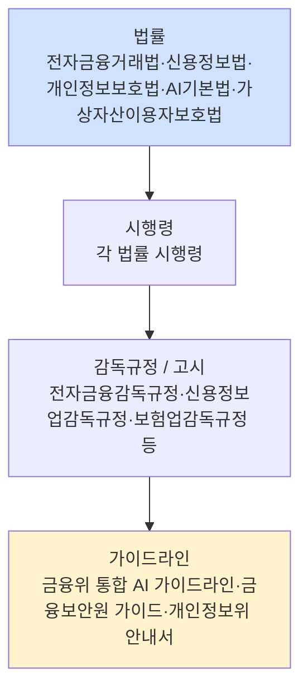
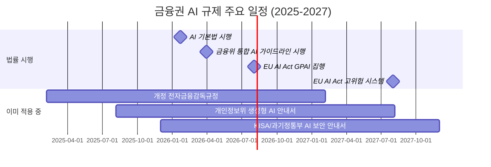
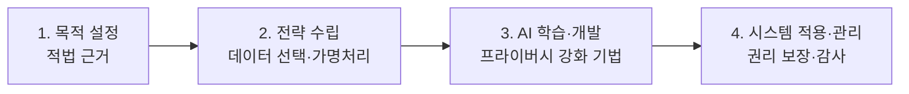

# 08. 한국 금융권 AI 보안 실무 가이드 (2026-04 기준)

금융권 보안 담당자가 **경영진·법무·감사·감독기관** 대응 시 펼치는 실무 문서다. 규제 조항을 암기할 필요는 없지만, **"어느 법령의 몇 조가 우리 AI 에 걸리는가"** 와 **"어떤 산출물을 누구에게 언제 제출하는가"** 는 이 문서에서 답이 나와야 한다.

> **중요 고지**
>
> - 본 문서는 **법률 자문이 아니다**. 적용 여부·해석은 법무팀 및 규제 기관 공식 질의를 통해 확정한다.
> - 인용된 법령·규정·일자는 **2026-04-19** 기준이며, 국내 금융 규제는 분기 단위로 개정된다. 실무 적용 전 국가법령정보센터 / 해당 감독기관 공식 원문을 반드시 재확인한다.
> - **시행 예정** 표기는 2026-04 시점 관계 부처 공지 기준 — 실제 시행일은 변동 가능.
> - 본 문서는 학습·실무 참고용이며, 본 문서의 인용·해석에 따른 책임은 각 조직에 있다.

---

## 1. 금융권 AI 규제 지도

### 1.1 법령 계층

한국 규제는 **법률 → 시행령 → 감독규정(고시) → 가이드라인** 4 단계로 내려온다. AI 관련 의무의 구체적 수준은 대부분 **감독규정·가이드라인** 에서 결정되므로, 법률 조문만 보면 실무 판단이 어렵다.



### 1.2 감독체계 — 누가 뭘 보는가

| 기관 | 주된 역할 | AI 관련 현황 |
|---|---|---|
| **금융위원회 (FSC)** | 금융정책·규정 제정 | 금융분야 AI 가이드라인 제·개정, AI 활용 지원방안 발표 |
| **금융감독원 (FSS)** | 검사·감독 집행 | IT·디지털 부문 검사, 자동화된 의사결정 검증 |
| **금융보안원 (FSEC)** | 금융 사이버보안 전담 | AI 모델 보안성 검증 (FSKU), 혁신금융 보안대책 평가, 레드팀 |
| **개인정보보호위원회 (PIPC)** | 개인정보 감독 | 생성형 AI 개발·활용 안내서, 자동화된 결정 대응권 |
| **과학기술정보통신부 (MSIT)** | AI 기본법 주무부처 | AI 기본법 시행령, 고영향 AI 분류 기준 |
| **한국인터넷진흥원 (KISA)** | 정보보호 지원·인증 | ISMS·ISMS-P 인증, AI 보안 안내서 |
| **금융정보분석원 (KoFIU)** | 자금세탁 방지 | VASP 등록·감독, 특정금융정보법 집행 |

### 1.3 업권별 1 차 규제 매트릭스

| 업권 | 기본 법률 | AI 관련 추가 규제 |
|---|---|---|
| 은행 | 은행법 | 전자금융거래법, 신용정보법, 금융분야 AI 가이드라인 |
| 증권 | 자본시장법 | 알고리즘 매매 관련 자본시장법 시행령, 거래소 업무규정 |
| 보험 | 보험업법 | 보험업감독규정, 의료정보 처리 시 보건의료 법령 |
| 카드·여전 | 여신전문금융업법 | 신용정보법 (신용평가 AI) |
| 전자금융업자 | 전자금융거래법 | 전자금융감독규정, 정보처리 업무 위탁 규정 |
| 핀테크 / 마이데이터 | 신용정보법 | 마이데이터 본인신용정보관리업 감독규정 |
| 가상자산사업자 (VASP) | 특정금융정보법, 가상자산이용자보호법 | AML, 이상거래 탐지 AI 관련 포괄 준수 |

**모든 업권 공통**: 개인정보보호법, AI 기본법 (2026-01-22 시행), 전자금융감독규정 (해당 업권에 적용되는 경우).

### 1.4 2026 규제 일정표



---

## 2. 전자금융감독규정 — 2025-02-05 개정 이후

### 2.1 "원칙 중심" 전환의 실무 의미

금융위는 2025-02-05 **원칙(Principle) 중심** 으로 규정을 슬림화했다. 중복·과도 규정 127 개 삭제, 166 개로 축소. **구체적 "하지 말라"** 가 줄고 **"결과 책임"** 이 커졌다 — AI 도입 실무 자율성은 늘었지만, **CISO 책임 영역도 확대**됐다.

**보안 담당자 실무 변화**:
- 세부 조항 하나하나 맞추는 방식 → **위험 기반 의사결정 문서화** 로 이동
- 사전 승인 위주 → **사후 보고·감사** 위주로 이동 (정보처리 위탁도 사후보고 체제로 전환)
- 내부 통제 역량이 약한 조직일수록 **자체 규정·가이드라인 작성 부담** 커짐

### 2.2 조항별 AI 관련 실무 체크 (전자금융감독규정)

> 조항 번호는 국가법령정보센터 기준이며, 2025-02-05 시행본 기준. 최신 개정 시 재확인.

| 분야 | 관련 조항 (예) | AI 실무 함의 |
|---|---|---|
| 정보보호 조직 | 제8조 (정보보호최고책임자) | AI 시스템 책임자를 CISO 지휘체계에 편입 |
| 정보처리시스템 안전성 | 제9조-제14조 | AI 모델·추론 인프라 접근통제, 암호화, 로그 보존 |
| 이상금융거래탐지 (FDS) | 제37조의4 | AI 기반 FDS 운영 시 모델 변경 관리 의무 |
| 전산실·백업 | 제11조 등 | AI 학습·추론 서버 이중화 요구, BCP 포함 |
| 정보보호점검 | 제37조의2 | 자체 점검 항목에 AI 모델 통제 포함 권장 |
| 사고보고 | 제73조 | AI 오작동으로 인한 전자금융사고 시 금감원·금융보안원 보고 |

> **정확한 조항 번호 확인**: 각 조항은 [국가법령정보센터 — 전자금융감독규정](https://www.law.go.kr/) 에서 "전자금융감독규정" 검색 → 최신 시행본 확인. 본 문서는 참조 지침.

### 2.3 생성형 AI 연구망 — 실무 요약

2025-02 개정으로 금융회사가 **생성형 AI 를 실험·검증할 수 있는 별도 망** 구성이 허용됐다. 핵심 원칙:

- 연구망은 **실거래 정보와 물리·논리적으로 분리**
- 개인정보·고객정보 **원본 사용 제한** (가명처리 원칙)
- 외부 클라우드 이용 시 정보처리 업무 위탁 규정 준수
- 연구 결과의 운영 이관 시 별도 승인 절차 필요

### 2.4 망분리·SaaS — AI 관점

SaaS 형 AI (Claude.ai, ChatGPT 웹 등) 는 **여전히 일반 업무망에서 민감정보 입력 불가** 가 원칙. 사내 Managed 환경 (예: Claude Enterprise + Managed Settings, Azure OpenAI 전용망) 을 구축하거나, **망분리 규제 샌드박스** 를 통해 별도 허가를 받아야 한다.

### 2.5 사고 보고 의무 — 시한 정리

| 사건 유형 | 보고 대상 | 시한 |
|---|---|---|
| 중대한 전자금융사고 | 금융감독원 | **즉시** (전자금융거래법 제21조의5) |
| 개인정보 유출 | 개인정보보호위원회, 정보주체 | **72시간 이내** (개인정보보호법 제34조) |
| 신용정보 유출 | 개인정보보호위, 금융위 | 지체없이 (신용정보법 제39조의4) |
| AI 오작동으로 인한 금융사고 | 금감원 (전자금융사고에 준함), 금융보안원 | 즉시/지체없이 |

---

## 3. 정보처리 업무 위탁 규정 — 외부 AI 도입 의무

### 3.1 체계 — 2025 이후 사후보고 체제

2025 개정 이후 클라우드 이용계약 신규 체결 시 **사후보고 의무** 로 전환. 평가·승인 중심에서 **사후 보고 + 내부 통제 강화** 로 이동.

### 3.2 CSP / AI 서비스 이용 유형별 적용

| 이용 형태 | 적용 규정 | 실무 포인트 |
|---|---|---|
| IaaS / PaaS (AWS, GCP, Azure 등) | 금융회사의 정보처리 업무 위탁 규정 + 전자금융감독규정 | CSP 평가, 중요도 판단, 사후보고 |
| **SaaS AI** (Claude.ai, ChatGPT Enterprise, Claude Code 등) | 동일 + SaaS 별도 평가기준 | 평가 간소화되었으나 **계약·데이터 흐름 명세 필수** |
| AI API 직접 호출 (Anthropic API, OpenAI API) | 위 규정 + 개인정보 국외이전 (개인정보보호법 제28조) | 해외 전송 근거, 리전 선택, 암호화 |
| 온프레미스 모델 (자체 파인튜닝) | 내부 규정 중심 | 모델 파일·학습 데이터 접근통제 |

### 3.3 중요도 판단 6 개 기준 (2025 개정 반영)

금융회사는 클라우드/AI 서비스의 **"중요도"** 를 스스로 평가해야 한다. 중요 업무로 판정되면 더 엄격한 통제가 적용된다.

1. 처리되는 업무의 **규모·복잡성**
2. 서비스 **중단 시 영향** (업무·고객)
3. **전자적 침해행위** 발생 시 고객에게 미치는 영향
4. **CSP 종속 위험** (특정 벤더 락인)
5. 금융회사의 **내부통제 역량**
6. 기타 — 고객정보 민감도 등

### 3.4 계약 필수 조항 체크리스트 (외부 AI 벤더)

```
[ ] 데이터 처리 목적·범위·기간 명시
[ ] 국외 이전 시 보관 국가·보안 수단 명시
[ ] 재위탁(서브프로세서) 사전 동의 또는 통지 조항
[ ] 학습 데이터 사용 여부 — 기본 Opt-out 명시
[ ] 모델 출력의 저작권·책임 귀속
[ ] 감사 접근권 (Right to Audit)
[ ] 서비스 종료 시 데이터 반환·파기 절차
[ ] SLA (가용성 %) 및 장애 보상
[ ] 침해사고 발생 시 통지 시한 (72시간 등)
[ ] 준거법·관할 (분쟁 시 대한민국 법원 우선 협상)
[ ] 관계 법령 (개인정보보호법, 전자금융거래법 등) 준수 의무
```

### 3.5 Anthropic / OpenAI / Google 해외 AI API 실무

- **데이터 리전**: Anthropic 은 기본 US 리전 — EU/APAC 리전 선택 가능성은 플랜별 확인 필요
- **국외 이전 근거**: 개인정보보호법 제28조의8 — 동의, 법적 요구, 계약 이행, 보호수준 인정 국가 등
- **학습 사용 여부**: 기업 플랜 (Team/Enterprise) 은 기본 학습 미사용이 통상 — 약관 원문 직접 확인
- **감사 로그**: Enterprise 플랜에서 compliance API/export 제공

---

## 4. 개인정보·신용정보 — AI 학습·추론 시 점검

### 4.1 개인정보보호법 — 자동화된 결정 대응권

**제37조의2** (자동화된 결정에 대한 정보주체의 권리) — 2023 개정으로 신설.

핵심:
- 완전히 자동화된 결정 (사람 개입 없이 AI 만으로 결정) 에 대해 정보주체는:
  1. **거부할 권리**
  2. **설명을 요구할 권리**
  3. **이의를 제기할 권리**
- 정보주체의 권리·의무에 **중대한 영향** 을 미치는 경우에 적용
- 처리 절차·기준을 **사전 공개** 의무

**금융권 실무**: 대출 심사, 보험 인수, 신용평가, 이상거래탐지 차단 등에서 **사람의 최종 검토 단계** 를 설계에 반드시 포함.

### 4.2 신용정보법 — 완전 자동화 결정 설명 의무

**신용정보법 제36조의2** (자동화평가 결과에 대한 설명 및 이의제기 등) — 완전 자동화된 신용평가 결과에 대해:

- 개인신용정보 주체는 **평가 결과 설명 요구**
- 평가 기준·방법의 적절성에 대한 **이의 제기**
- 신용정보회사는 **합리적 기간 내 대응 의무**

**실무**: 내부등급법(IRB) 기반 AI 신용평가 모델은 **설명가능성 (XAI)** 을 사전에 설계. 모델이 블랙박스면 규제 대응 어려움.

### 4.3 가명처리 — 금융권 특례와 한계

- **신용정보법 제32조의2** — 과학적 연구·통계 작성 목적으로 가명처리 가능
- **신용정보법 제32조의6** — 결합 전문기관을 통한 가명정보 결합
- 가명처리만으로 **연구 목적 달성이 곤란한 경우** — 개인정보위 심의·의결 하에 원본 활용 특례 추진 중 (2025-)

**AI 학습 데이터 관점**:
- 원본 신용정보 **그대로 학습** 금지가 기본
- 가명처리 후 학습 → 재식별 위험 평가 필수
- **개인정보 이노베이션존** 활용 검토 (개인정보위 지정)

### 4.4 개인정보위 생성형 AI 안내서 4 단계 점검표 (2025-08)

정식 명칭: **생성형 인공지능(AI) 개발·활용을 위한 개인정보 처리 안내서** (2025-08-06 개인정보보호위원회 발간).



| 단계 | 금융권 점검 항목 |
|---|---|
| **1. 목적 설정** | 처리 목적 명시, 동의/정당한 이익/법령 근거 중 선택, 최소수집 원칙 |
| **2. 전략 수립** | 학습 데이터 출처·적법성, 공개된 개인정보 활용 시 추가 근거, 가명처리 설계 |
| **3. 학습·개발** | 재식별 위험 평가, 차등 프라이버시 적용 검토, 학습 데이터 이력 관리 |
| **4. 적용·관리** | 정보주체 권리 보장 절차, CPO 거버넌스, 사고 대응 체계, 감사 로그 |

**핵심 메시지**: **CPO 중심 거버넌스** — CISO 가 단독으로 AI 거버넌스를 들고 가는 구조는 부적합. CPO · CISO · 컴플라이언스 삼각 구조 필수.

### 4.5 AI 기본법 — AI 영향평가 의무 (2026-01-22 시행)

**인공지능 발전과 신뢰 기반 조성 등에 관한 기본법** (2025-01-21 공포, 2026-01-22 시행).

**금융권 직접 관련 의무**:
- **고영향 AI** (Art. 2 제4호) — 채용, 대출 심사, 의료, 교통 등 10개 영역 중 금융 관련 = **대출 심사** 명시
- 고영향 AI 사업자는:
  1. 위험관리방안 수립·운영
  2. 설명 가능성 확보
  3. 이용자 보호를 위한 조치
  4. **AI 영향평가** 실시
- 생성형 AI 사용 시 **AI 산출물 표시 의무**

**시행령 상태** (2026-04-19 기준):
- 입법예고·의견수렴 단계 거쳐 제정 중
- 시행 초기 **1년 이상 행정 지도 기간** 운영 예정 (과징금 미부과, 가이드 위주)
- **최종 시행령·세부 고시**는 국가법령정보센터 및 과기정통부 공지 재확인 필요

---

## 5. 금융위 통합 AI 가이드라인 7대 원칙 실행표

금융위는 2025 말 통합 가이드라인(안) 을 공개하고 **2026 Q1 시행 예정**. 금융연구원·업계 의견수렴 및 AI 기본법 하위규정 정합성 반영.

### 7 대 원칙 → 담당·산출물·주기 매핑

| # | 원칙 | 요구 사항 (요약) | 담당 부서 | 산출물 | 주기 |
|---|---|---|---|---|---|
| 1 | **거버넌스** | AI 윤리위 · 독립 전담조직 | 경영진 · CISO · CPO · 컴플 | AI 윤리위 규정, 분기별 회의록 | 분기 |
| 2 | **합법성** | 관계 법령 정합성 | 법무 · 컴플 | 법적 검토보고서 | AI 도입 시 + 연 1회 |
| 3 | **보조수단성** | AI 의사결정 보조, 최종 책임은 임직원 | 업무 부서 · CISO | 사람 결재 단계 설계 문서 | AI 도입 시 |
| 4 | **신뢰성** | 공정성·편향·오류 대응 | IT · 리스크 | 모델 테스트 결과, 편향성 평가 보고 | 반기 |
| 5 | **금융안정성** | 시스템 리스크 전파 방지 | IT · 리스크 | BCP, DR 시나리오 (AI 포함) | 반기 |
| 6 | **신의성실** | 고객 이익 우선, 설명가능성 | CPO · 마케팅 · IT | XAI 문서, 고객 설명 자료 | 상시 |
| 7 | **보안성** | 모델·데이터·운영 보안 | CISO · 정보보호 | 정보보호 계획, 레드팀 결과 | 연 1회 이상 |

### 원칙별 세부 의무 — 실무 레벨

#### 원칙 1. 거버넌스
- **AI 윤리위원회 구성** — 경영진·독립 위원 포함
- **독립 전담조직** — AI 거버넌스 책임자 지정 (CDAO / AI 책임자)
- 위험관리·윤리 기준 **연간 리뷰**
- AI 기본법상 "AI 영향평가" 연계

#### 원칙 2. 합법성
- AI 시스템별 **적용 법령 매핑표** 작성·유지
- 개인정보보호법, 신용정보법, 저작권법, 금융관련법 모두 확인
- 해외 시장 대상이면 **EU AI Act** 추가

#### 원칙 3. 보조수단성 (가장 중요)
- **최종 의사결정은 사람** — AI 는 보조
- 예외 가능 업무 (FDS 자동 차단 등) 는 **사후 인간 검토** 필수
- 권한 부여 매트릭스: AI 자율 결정 범위 ≤ 사람 승인 범위 ≤ 조직 권한
- **Claude Code · Agent 도구 호출** 에도 같은 원칙 — 파괴적 작업 (DB 삭제, 자금이체 등) 은 반드시 인간 승인

#### 원칙 4. 신뢰성
- 모델 **정확도·공정성·안정성** 지표
- 학습 데이터 편향 검사 (성별·연령·지역 분포)
- 모델 변경 시 **재검증** — 금융보안원 FSKU 활용 권장
- 오류 대응 — **모델 롤백 경로** 사전 설계

#### 원칙 5. 금융안정성
- AI 의 **집단적 사용** 이 시장에 미치는 영향 (예: 모두가 같은 모델로 신용평가 → 시스템 리스크)
- 장애 시 **대체 수단** (수동 프로세스) 준비
- **공통 모델 의존도** 관리 — 특정 벤더 집중 위험

#### 원칙 6. 신의성실
- AI 산출물의 **설명 가능성** — 고객 요청 시 이해 가능한 수준 설명
- AI 로 인한 **고객 불이익 최소화**
- 생성형 AI 사용 시 **AI 생성물 고지** (AI 기본법 요구사항과 중첩)

#### 원칙 7. 보안성 (정보보호 최고 관심 영역)
- **04 챕터 OWASP LLM Top 10** 레시피 적용
- **05 챕터 에이전트·MCP** 통제
- **06·07 챕터 Claude Code** 훅 · Managed Settings · SIEM 연계
- **금융보안원 레드팀** 수검 또는 자체 실시

---

## 6. 금융보안원 대응

### 6.1 혁신금융서비스 보안대책 평가

금융규제 샌드박스(혁신금융서비스) 로 지정된 AI 서비스는 금융보안원의 **보안대책 평가** 를 받는다. 2023-06 이후 2025 말까지 **총 83건 접수, 52건 완료**.

**평가 프로세스** (공개 자료 기반 개괄):
1. 금융위 혁신금융 지정
2. 금융회사·핀테크 → 금융보안원에 보안대책 제출
3. 금융보안원 서면·기술 평가
4. 개선 권고 및 재평가
5. 최종 평가 완료 시 서비스 운영 가능

**제출 자료 (일반적 구성)**:
- 시스템 아키텍처, 데이터 흐름도
- 정보보호 통제 체계 (접근통제, 암호화, 로그)
- AI 모델 관리 방안 (변경·롤백·편향 관리)
- 사고 대응 계획
- 개인정보 영향평가 결과

### 6.2 AI 모델 보안성 검증 (FSKU)

금융보안원은 **FSKU (Financial Security Knowledge Understanding)** 평가지표를 자체 개발·운영. **금융보안 관련 QA 1,000개** 로 생성형 AI 모델의 정확성을 평가.

**활용법**:
- 자사 도입 전 후보 모델을 FSKU 로 사전 평가 요청
- 내부 RAG 시스템에 FSKU 유사 데이터셋 구축해 자체 검증 파이프라인

### 6.3 2025 AI 레드팀 보고서 — 금융권 대응

금융보안원이 공개한 **2025 AI 레드팀 보고서** 의 공격 세대별 금융권 AI 대응 현황:

| 세대 | 공격 방식 | 대응 |
|---|---|---|
| 1 | 단순 탈옥 | 대체로 방어 |
| 2 | 역할극·다단계 우회 | 부분 방어 |
| **3** | 긴 문맥·지식 DB 오염 | **취약** |
| **4** | 도구 사용 조작 → 금융 시스템 피해 | **안전장치 무력화** |

**금융권 실무 대응**:
- **RAG 시스템** → 인덱싱 데이터 무결성 검증 / 벡터 DB 접근 통제 (3세대 대응)
- **MCP·Function Calling** 금융 시스템 연결 시 → 도구 권한 최소화, 고위험 작업은 **2FA 재승인** (4세대 대응)
- 07 챕터 Lab 7.3 탐지 룰은 기초 — 조직 환경에 맞춰 **튜닝 필수**

### 6.4 금융권 CERT 연계

금융보안원은 **F-ISAC (금융 ISAC)** 를 운영. AI 관련 사고·위협 정보 공유 채널. AI 사고 발생 시 업계 공유를 통해 **유사 조직 선제 대응** 지원.

---

## 7. 업권별 추가 의무

### 7.1 은행 — 여신심사 AI, 이상거래탐지

- 여신심사 AI 는 **고영향 AI** 해당 (AI 기본법) — **영향평가 의무**
- 신용정보법 제36조의2 **자동화평가 설명 의무**
- 이상거래탐지 (FDS) — 전자금융감독규정 제37조의4 모델 변경 관리
- **BASEL III / 내부등급법** 과 연계 시 모델 승인 절차 추가 (금감원)

### 7.2 증권 — 알고리즘 트레이딩

- **자본시장법 제180조의5** 시장질서 교란행위 — AI 도 위반 주체
- **거래소 업무규정** — 알고리즘 매매 사전 신고, 고빈도 매매 모니터링
- AI 기반 로보어드바이저 — 자본시장법 제6조 투자자문업 인가 대상 여부 확인
- 사전 **시뮬레이션 거래 환경** 필수

### 7.3 보험 — 언더라이팅·지급심사

- 보험업법 + 보험업감독규정상 **언더라이팅 기준** 문서화 의무
- AI 인수심사 모델은 **의료정보** 처리 시 보건의료법 교차 검토
- 사고 지급심사 AI 는 **소비자 권리 침해** 위험 높음 → 신의성실 원칙 (금융위 7대 원칙 6번) 엄격 적용
- 삼성화재·교보생명 등 국내 사례 — AI 가 **대체 판단**, 사람은 **최종 검토**

### 7.4 카드·여전 — 이상거래탐지·신용평가

- 신용카드 FDS 는 **전자금융감독규정** 및 **여신전문금융업법** 적용
- 신용평가 AI → 신용정보법 제36조의2 설명 의무
- **개인신용평가회사 (CB사)** 위탁 시 신용정보업감독규정 확인

### 7.5 전자금융업자 — PG·간편결제 AI

- PG·간편결제에서 사용되는 **이상거래탐지·본인확인 AI** — 전자금융감독규정 준수
- 특히 **eKYC** (간편 본인확인) AI 는 **금융실명법** + 특정금융정보법 교차
- 라이브니스 검증, 얼굴인식 AI → 생체정보 처리 시 **개인정보보호법 민감정보** 특칙 적용

### 7.6 가상자산사업자 (VASP)

- **특정금융정보법** — VASP 등록, ISMS 의무, 이상거래 보고 (STR)
- **가상자산이용자보호법** (2024-07-19 시행) — 이용자 자산 보호, 시세조종 금지
- AI 특정 조항은 없으나:
  - 이상거래탐지 AI → 특정금융정보법 감독 대상
  - 고객응대 AI → 개인정보보호법 + 가상자산이용자보호법 정보제공 의무
  - AI 기반 자동매매 도구 제공 시 별도 규제 검토 필요
- **2025 개정 특정금융정보법** — 사전 구조적 규제 강화, 진입규제 실질화 (건전 재무, 컴플 조직, 전산설비, 내부통제)

---

## 8. AI 도입 단계별 체크리스트

### 8.1 기획 단계

```
[ ] 유스케이스 분류 (AI 기본법 고영향 AI 해당 여부)
[ ] 법적 근거 확인 (개인정보 동의, 신용정보 활용 근거 등)
[ ] 관계 법령 매핑표 작성
[ ] AI 영향평가 필요 여부 (고영향 AI 이면 의무)
[ ] 금융위 혁신금융서비스 지정 필요 여부
[ ] 예산·리스크 승인 (AI 윤리위 or 리스크관리위)
산출물: 기획서, 법적 검토 의견, 영향평가 초안
승인: 사업부장 + 컴플 + 법무 + 정보보호
```

### 8.2 개발 단계

```
[ ] 학습 데이터 적법성 (가명처리 / 정당한 이익 / 동의)
[ ] 개인정보 영향평가 (PIA)
[ ] 편향성·공정성 평가
[ ] 모델 카드·데이터 카드 작성
[ ] 설명 가능성 설계 (XAI 기법 적용)
[ ] 보조수단성 설계 (인간 개입 지점 명시)
[ ] 정보보호 통제 — 04·05·06·07 챕터 전면 적용
[ ] 레드팀 테스트 계획
산출물: 모델 카드, PIA 보고서, 설계 문서, 레드팀 계획서
승인: CISO + CPO + 개발책임자
```

### 8.3 운영 단계

```
[ ] Managed Settings / Hook DLP 배포 (06 챕터)
[ ] 감사 로그 SIEM 연계 (07 챕터 Lab 7.2)
[ ] 모델 성능·편향 모니터링 상시
[ ] 정보주체 권리 응대 절차 (열람·삭제·설명·이의)
[ ] 사고 대응 훈련 (년 1회 이상)
[ ] 모델 변경 관리 (버전·변경 이력·재승인)
[ ] 금융보안원 보안성 평가 대응 (혁신금융 대상 시)
[ ] F-ISAC 정보 공유 참여
산출물: 운영 로그, 월간 모니터링 리포트, 사고 대응 이력
보고: CISO 월보, AI 윤리위 분기 보고
```

### 8.4 사고 대응 단계

```
[ ] 사고 인지 즉시 상황실 가동
[ ] 영향 범위·피해 규모 평가
[ ] 법정 보고 (각 규제별 시한 준수 — 섹션 2.5 참조)
[ ] 증거 보존 — 로그 · 모델 스냅샷 · 프롬프트 이력
[ ] 정보주체 통지 (개인정보 유출 시 72시간 + 필요 시 언론)
[ ] 금감원 / 금융보안원 보고
[ ] 근본원인 분석 (RCA) 및 재발방지 대책
[ ] 재발방지 대책을 정책·훅·룰에 반영
산출물: 사고보고서, RCA 보고서, 재발방지 계획
승인: CEO·이사회·감사위
```

### 8.5 폐기 단계

```
[ ] 서비스 종료 공지 (이용자 대상)
[ ] 학습 데이터 · 모델 파일 · 로그 폐기 절차
[ ] 벤더 계약 종료 시 데이터 반환·파기 확인
[ ] 위탁 해지 금융위 보고 (해당 시)
[ ] 개인정보 파기 (개인정보보호법 제21조)
[ ] 감사 증적 보존 (5년 등 법정 기간)
산출물: 폐기 보고서, 데이터 파기 증빙
승인: CISO + CPO
```

---

## 9. 감독 검사 대응 실무

### 9.1 금감원 IT · 디지털 검사 시 AI 관련 제출 자료

금감원 **IT감독업무규정** 및 검사 매뉴얼 기반 일반적 요구 자료 (실제 검사 시 개별 요청에 맞춰 조정).

| 카테고리 | 제출 자료 |
|---|---|
| 거버넌스 | AI 윤리위 규정·회의록, CISO·CPO 지정 문서, AI 책임자 조직도 |
| 정책·내규 | AI 사용 정책 (AUP), 정보처리 위탁 내규, AI 모델 변경관리 절차 |
| 모델 관리 | 모델 카드, 학습 데이터 이력, 성능·편향 모니터링 리포트 |
| 정보보호 | 정보보호계획서, 접근통제·암호화 증빙, 감사 로그 샘플 |
| 위탁 관리 | 외부 AI 벤더 목록, 계약서, CSP 평가 보고서, 사후보고 이력 |
| 사고 이력 | AI 관련 사고 이력, 재발방지 대책, 법정 보고 이력 |
| 감사·평가 | 내부감사 보고서, 레드팀 결과, 금융보안원 평가 이력 |
| 고객 응대 | 자동화된 결정 설명·이의제기 응대 이력 |

### 9.2 사고 발생 시 법정 보고 시한 정리

| 사고 유형 | 근거 | 보고 대상 | 시한 |
|---|---|---|---|
| 전자금융사고 | 전자금융거래법 §21-5 | 금감원 | 즉시 |
| 개인정보 유출 | 개인정보보호법 §34 | 개인정보위, 정보주체 | **72시간 이내** |
| 신용정보 유출 | 신용정보법 §39-4 | 개인정보위, 금융위 | 지체없이 |
| 침해사고 | 정보통신망법 §48-3 | KISA | 즉시 |
| ISMS-P 인증사고 | ISMS 인증제도 | KISA | 별도 정해진 절차 |
| VASP 침해·유출 | 가상자산이용자보호법 §8 | 금융위 | 지체없이 |

### 9.3 검사 지적 패턴 (공개 사례 기반)

과거 금감원·금융보안원 검사에서 지적된 **공통 패턴** (공개 보도자료 · 제재 사례 기반 일반화):

- 내규와 실제 운영 괴리 (문서만 있고 증빙 없음)
- 위탁 관리 부실 (계약 존재하나 실질 감독 없음)
- 사고 보고 시한 미준수
- 접근통제 기록 미비
- 이상거래탐지 룰 업데이트 이력 관리 부재
- 변경관리 절차 우회 (긴급 변경이 일상화)

**AI 특화 예상 지적 사항 (2026 이후 본격 검사 시)**:
- AI 영향평가 미실시
- 자동화된 결정 설명 절차 부재
- 모델 편향·공정성 점검 증빙 없음
- Managed Settings · Hook 배포했으나 **감사 로그 수집·분석 실질 이뤄지지 않음**
- 외부 AI 벤더 사후보고 누락

---

## 10. 12개월 컴플라이언스 캘린더 (예시)

조직별 의무 시점이 다르므로 **이 캘린더를 기반으로 자체 맞춤** 작성.

| 월 | 정기 과제 |
|---|---|
| **1월** | 전년 감사 결과 취합, AI 윤리위 연간 계획 수립, AI 기본법 시행 대응 점검 |
| **2월** | 전자금융감독규정 정합성 자체 점검, 금감원 연간 검사 계획 공지 확인 |
| **3월** | **금융위 통합 AI 가이드라인 시행** (2026 Q1), 가이드라인 적합성 점검 |
| **4월** | 1Q AI 윤리위 정기 회의, 모델 성능·편향 분기 리포트 |
| **5월** | 외부 AI 벤더 연간 재평가, ISMS-P 갱신 준비 |
| **6월** | 반기 레드팀 수행, BCP 훈련 (AI 장애 시나리오 포함) |
| **7월** | 2Q AI 윤리위, **EU AI Act GPAI 집행 개시 준비** (해외 사업 시) |
| **8월** | **EU AI Act 2026-08-02 집행 개시** — 대응 완료 확인 |
| **9월** | 개인정보위 자율점검 (PIA 업데이트), CPO 연간 보고 |
| **10월** | 3Q AI 윤리위, 연말 감사 준비 착수, 모델 변경 이력 정리 |
| **11월** | 연간 레드팀 본격 수행, 외부 감사 대응 |
| **12월** | 4Q AI 윤리위, 연간 성과 · 사고 집계, 차년도 계획 |

**상시**: 사고 대응 훈련, 정보주체 권리 응대, 모델 모니터링, Hook 감사 로그 SIEM 분석.

---

## 11. 참조 자료

### 11.1 법령 · 규정 (국가법령정보센터 우선)

- [국가법령정보센터](https://www.law.go.kr/) — 모든 법령·감독규정 원문
- [전자금융거래법](https://www.law.go.kr/법령/전자금융거래법)
- [전자금융감독규정](https://www.law.go.kr/) (검색)
- [신용정보의 이용 및 보호에 관한 법률](https://www.law.go.kr/법령/신용정보의이용및보호에관한법률)
- [개인정보보호법](https://www.law.go.kr/법령/개인정보보호법)
- [인공지능 발전과 신뢰 기반 조성 등에 관한 기본법](https://www.law.go.kr/lsInfoP.do?lsiSeq=268543)
- [특정 금융거래정보의 보고 및 이용 등에 관한 법률](https://www.law.go.kr/법령/특정금융거래정보의보고및이용등에관한법률) (특정금융정보법)
- [가상자산 이용자 보호 등에 관한 법률](https://www.law.go.kr/LSW/lsInfoP.do?lsiSeq=261099)
- [금융회사의 정보처리 업무 위탁에 관한 규정](https://www.law.go.kr/)

### 11.2 감독기관 · 가이드라인

- [금융위원회](https://www.fsc.go.kr/)
- [금융감독원](https://www.fss.or.kr/)
- [금융보안원](https://www.fsec.or.kr/)
- [개인정보보호위원회](https://www.pipc.go.kr/)
- [과학기술정보통신부](https://www.msit.go.kr/)
- [한국인터넷진흥원 (KISA)](https://www.kisa.or.kr/)
- [금융위 금융분야 AI 가이드라인 개정방향 (PDF)](https://www.fsc.go.kr/comm/getFile?srvcId=BBSTY1&upperNo=85908&fileTy=ATTACH&fileNo=13)
- [금융위 금융권 생성형 AI 활용 지원방안 (PDF)](https://www.fsc.go.kr/comm/getFile?srvcId=BBSTY1&upperNo=83594&fileTy=ATTACH&fileNo=7)
- [개인정보위 생성형 AI 개발·활용 안내서 (2025-08)](https://www.pipc.go.kr/np/cop/bbs/selectBoardArticle.do?bbsId=BS074&mCode=C020010000&nttId=11410)
- [금융보안원 공지사항](https://www.fsec.or.kr/bbs/detail?menuNo=69&bbsNo=11629)

### 11.3 글로벌 참조 (비교 관점)

- [NIST AI RMF](https://www.nist.gov/itl/ai-risk-management-framework)
- [NIST-AI-600-1 GenAI Profile](https://nvlpubs.nist.gov/nistpubs/ai/NIST.AI.600-1.pdf)
- [ISO/IEC 42001](https://www.iso.org/standard/42001)
- [EU AI Act](https://artificialintelligenceact.eu/)

### 11.4 본 시리즈 관련 챕터

- [04. OWASP LLM Top 10:2025 방어 레시피](04_llm_top10_defense_recipes.md)
- [05. 에이전트 보안 실전 플레이북](05_agent_security_playbook.md)
- [06. Claude Code CLI 보안](06_claude_code_cli_security.md)
- [07. 실전 종합 랩](07_integrated_labs.md)

---

## 부록 A. AI 윤리위원회 규정 템플릿 (요약본)

```markdown
# [회사명] AI 윤리위원회 운영 규정

제1조 (목적) 본 규정은 [회사명]의 AI 활용에 대한 윤리·보안·리스크 통제를 위한
       위원회 운영에 관한 사항을 정한다.

제2조 (구성)
  ① 위원장: CEO 또는 CEO 가 지정하는 임원
  ② 위원: CISO, CPO, 컴플라이언스 임원, 법무 임원, IT 임원, 리스크 임원,
          외부 독립 위원 1인 이상
  ③ 간사: AI 거버넌스 책임자 (CDAO 또는 지정자)

제3조 (심의·의결 사항)
  1. AI 사용 정책 (AUP) 제·개정
  2. 고영향 AI 도입·운영 승인
  3. AI 영향평가 결과 검토
  4. 중대 AI 사고 대응 방향 결정
  5. 외부 AI 벤더 도입 승인 (중요 등급)
  6. 연간 AI 보안 계획·예산

제4조 (운영)
  ① 정기회의: 분기 1회
  ② 임시회의: 중대 사안 발생 시
  ③ 의결: 재적 위원 과반 출석, 출석 위원 과반 찬성
  ④ 회의록 3년 보존

제5조 (보고) 연 1회 이사회 및 감사위원회 보고
```

## 부록 B. 정보보호 담당자 초도 30일 점검 체크리스트

신규 보안 담당자가 부임 직후 30일 내 완료하는 점검.

```
[Week 1]
[ ] 현재 사내에서 쓰이는 AI 서비스 전수 조사 (공식·비공식 모두)
[ ] 외부 AI 벤더 계약서 목록 확보
[ ] Claude Code / ChatGPT / Copilot 등 사용 현황 파악
[ ] 기존 AI 사용 정책 유무 확인

[Week 2]
[ ] 관련 법령 적용 상태 점검 (본 문서 섹션 1 기준)
[ ] 2025-02 전자금융감독규정 개정 반영 상태
[ ] 개인정보위 생성형 AI 안내서 4단계 적용 상태
[ ] AI 기본법 2026-01 시행 대응 준비 상태

[Week 3]
[ ] 기존 Hook / 감사 로그 / SIEM 연계 여부
[ ] Managed Settings 배포 여부
[ ] 외부 AI API 호출 경로 (직접 / 게이트웨이)
[ ] 최근 1 년 AI 관련 사고·인시던트 이력

[Week 4]
[ ] 경영진 브리핑 준비 — 현황 평가 + Gap + 향후 12개월 로드맵
[ ] AI 윤리위 설치 제안
[ ] 금융보안원 F-ISAC 참여 여부 확인
[ ] 연간 레드팀·감사 계획 수립
```
