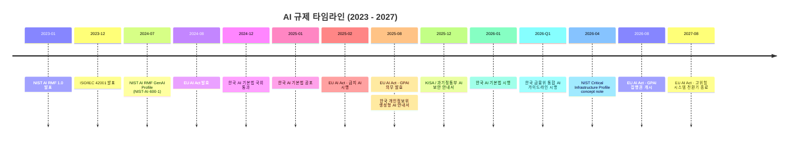
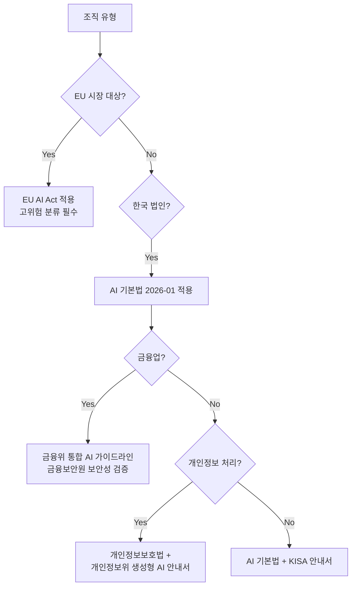
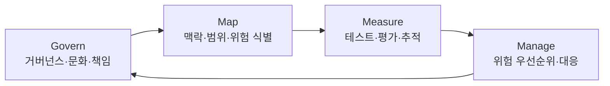
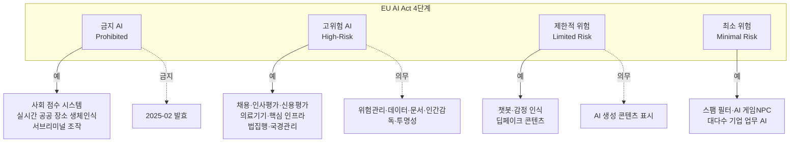
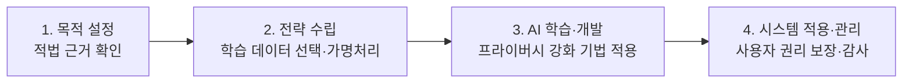
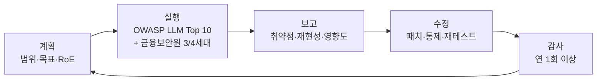

# 08. AI 보안 정책·거버넌스 프레임워크 (2026-04 기준)

보안 담당자가 **경영진·법무·감사** 에게 "우리 조직이 왜 이 통제를 해야 하는가" 를 설명할 때 꺼내는 문서다. 개별 규제·표준을 모두 암기할 필요는 없지만, **어디서 무엇을 찾는지** 와 **우리 조직이 지금 무엇부터 해야 하는지** 는 이 한 문서에서 답을 낼 수 있어야 한다.

> **문서 스코프와 한계** (먼저 명시)
>
> - 본 문서는 **2026-04 시점** 공식 자료를 기반으로 작성됐다. 규제는 분기 단위로 변경되므로 실제 의사결정 전 공식 출처를 반드시 재확인한다.
> - 한국 금융권 관점의 비중이 높다. 비금융 업종은 4.1, 4.4, 4.5 섹션 중심으로 활용한다.
> - 법률 자문이 아니다. 적용 여부는 법무팀·규제 당국 확인을 거친다.

---

## 1. 2026-04 규제 지형 한눈에

### 1.1 타임라인



### 1.2 관할 매트릭스

| 구분 | 글로벌 | 국내 일반 | 국내 금융권 |
|---|---|---|---|
| **법적 구속력** | EU AI Act (해외기업도 EU 시장 진입 시 적용) | AI 기본법 (2026-01 시행) | AI 기본법 + 전자금융감독규정 |
| **권고·프로파일** | NIST AI RMF, OECD AI Principles | KISA / 과기정통부 AI 보안 안내서 | 금융위 통합 AI 가이드라인 (2026 Q1) |
| **인증** | ISO/IEC 42001 (자발) | ISMS / ISMS-P | 금융보안원 보안성 검증 |
| **개인정보** | GDPR | 개인정보보호법 + 개인정보위 생성형 AI 안내서 | 동일 + 신용정보법 |
| **레드팀/감사** | NIST RMF Measure · Manage 함수 | (권고) | 금융보안원 AI 레드팀 보고서 (2025) |

### 1.3 "우리 조직이 적용 받는 것" 판단 흐름



---

## 2. 3대 글로벌 표준 비교

2026-04 시점 **실무에서 가장 자주 인용되는** 3개 표준이다. 서로 배타적이지 않으며, 조직 성숙도에 따라 **병행 적용**하는 것이 일반적이다.

### 2.1 한눈에 비교

| 항목 | NIST AI RMF | ISO/IEC 42001 | EU AI Act |
|---|---|---|---|
| 성격 | 자발적 가이드 | 인증 가능 경영시스템 | 법적 구속력 |
| 발표 시점 | 2023-01 (1.0) | 2023-12 | 2024-08 발효 |
| 핵심 구조 | Govern·Map·Measure·Manage 4 함수 | AIMS (AI Management System) PDCA | 위험 기반 4단계 |
| 생성형 AI 전용 | NIST-AI-600-1 GenAI Profile (2024-07) | 일반 AI 포괄, 별도 부록 없음 | GPAI 별도 조항 |
| 적용 대상 | 모든 AI 개발·활용 조직 | AI를 제공·활용하는 조직 | EU 시장 내 AI 시스템 |
| 강제성 | 없음 | 없음 (인증은 선택) | **있음** — 위반 시 과징금 최대 연매출 7% |
| 2026-04 업데이트 | Critical Infrastructure Profile concept note | SAP·Microsoft 등 주요 벤더 인증 진행 | GPAI 집행권 2026-08 개시 예정 |

### 2.2 NIST AI RMF — 뼈대는 4 함수



- **자발적**: 강제성 없음. 하지만 미국 연방기관·계약사와 협업 시 사실상 요구됨.
- **GenAI Profile (NIST-AI-600-1)**: 2024-07 발표. 생성형 AI 고유 위험 12개 식별 (confabulation, data privacy, harmful bias, information integrity, obscene content, value chain risks 등).
- **2026-04**: Critical Infrastructure Profile concept note 공개 — 이후 섹터별 프로파일 확장 예정.

### 2.3 ISO/IEC 42001 — 인증 가능 AIMS

- **AIMS (AI Management System)** 를 위한 세계 최초 국제 표준 (2023-12).
- ISO 27001 과 구조 동일 — PDCA 사이클 + 부속서 A 통제 목록.
- **2026 기준 인증 벤더**: SAP (2025 Joule·SAP AI Core 인증), Microsoft (M365 Copilot, Copilot Chat 정기 감사).
- 의미: **벤더 평가 시 ISO 42001 인증 유무가 주요 판단 지표**가 되고 있음. 외부 AI 도입 심사 체크리스트(섹션 6)에 반영.

### 2.4 EU AI Act — 법적 구속력, 2026-08 집행 개시

- 위반 시 **연매출 7% 또는 €35M** 과징금 (금지 AI), 3% 또는 €15M (고위험 위반).
- **해외 기업도 EU 시장에 AI 시스템을 제공하면 적용** (GDPR 과 유사한 역외 적용).
- 2026-04 시점 핵심 일정:
  - **2026-08-02**: GPAI 제공자에 대한 Commission 집행권 개시 (2025-08 의무 발효 후 1년 유예)
  - **2027-08-02**: 고위험 시스템 전환기 종료
  - 2025-08-02 이전 출시 GPAI 모델 → **2027-08-02까지** 준수 완료 유예

### 2.5 3개 표준의 매핑 (요약)

| 주제 | NIST | ISO 42001 | EU AI Act |
|---|---|---|---|
| 거버넌스 구조 | Govern 함수 | Clause 5 (Leadership) | Art. 17 QMS |
| 위험 식별·분류 | Map 함수 | Clause 6 + Annex A 통제 | Art. 6-9 위험 분류 |
| 테스트·평가 | Measure 함수 | Clause 8 Operations | Art. 15 정확도·견고성 |
| 사고 대응 | Manage 함수 | Clause 10 Improvement | Art. 73 심각한 사고 보고 |
| 투명성 | GenAI Profile #5 | Annex A A.6 | Art. 50 사용자 고지 |

**실무 원칙**: 하나의 조직 정책 문서를 만들고 각 요구사항에 3개 표준 조항을 모두 태깅하는 것이 효율적이다 (단일 소스·복수 준수).

---

## 3. EU AI Act 위험 4단계 & 자기 유스케이스 분류

해외 시장에 내놓지 않아도, **"우리 AI 시스템이 어느 등급에 해당하는가"** 를 식별하는 훈련 자체가 조직의 위험 감각을 키운다.



### 3.1 GPAI (General Purpose AI) 별도 트랙

일반 목적 AI 모델은 4단계와 **별개의 의무** 를 진다.

| 구분 | 의무 | 2026-08 집행 |
|---|---|---|
| **일반 GPAI** | 기술 문서화, 데이터 요약 공개, 저작권 정책 | Commission 집행권 개시 |
| **Systemic Risk GPAI** (10^25 FLOPs 이상) | 위 + 적대적 평가, 사고 보고, 사이버보안 | 동일 |

국내 조직이 Claude · GPT · Gemini 등을 **사용**할 때는 GPAI 제공자가 아니라 **후속 제공자 / 배포자** 로 분류된다. 고위험 분류에 들어가는 유스케이스에 이 모델을 통합하면 **배포자 의무** (Art. 26) 가 발동한다.

### 3.2 자기 조직 분류 워크시트 (체크리스트)

```
[유스케이스 이름]: _______________

1. 의사결정 대상이 사람인가? (채용·신용·의료·법적 권리)
   [ ] Yes → 고위험 가능성
   [ ] No

2. 안전·생명과 직결되는가? (의료기기·차량·핵심 인프라)
   [ ] Yes → 고위험 가능성
   [ ] No

3. 실시간 공공 생체인식 / 감정 인식을 쓰는가?
   [ ] Yes → 금지 또는 고위험
   [ ] No

4. 사용자에게 AI 라는 사실이 명확한가?
   [ ] No → 투명성 의무 (Art. 50)
   [ ] Yes

5. AI 생성 콘텐츠를 공개하는가?
   [ ] Yes → 워터마킹·표시 의무
   [ ] No

6. 우리가 이 모델을 직접 훈련했는가?
   [ ] Yes → 제공자 의무
   [ ] No → 배포자 의무 (더 가벼움)
```

---

## 4. 국내 법·가이드 — 금융권 중심

### 4.1 한국 AI 기본법 (2026-01-22 시행)

정식 명칭: **인공지능 발전과 신뢰 기반 조성 등에 관한 기본법**.

- 2024-12-26 국회 통과, 2025-01-21 공포, **2026-01-22 시행**.
- 한국은 **EU 다음 세계 두 번째** 포괄적 AI 법제 국가.
- 19개 AI 관련 법안을 하나로 통합.
- 핵심 의무:
  - **고영향 AI** 분류 및 고지
  - **생성형 AI** 사용 고지 의무
  - **AI 영향평가** 의무 (세부 기준 시행령으로)
  - **안전성 확보 조치** 의무
- 특징: EU 대비 **"산업 진흥"** 에 무게 — 처벌 수위 상대적으로 낮음, 과학기술정보통신부 주관.
- **하위 시행령** 은 법제처 입법예고 (2025) 를 거쳐 시행 전후 확정 — 2026-04 시점 최종본 확인 필요.

### 4.2 금융위 통합 AI 가이드라인 (2026 Q1 시행 예정)

기존에 분산됐던 금융분야 AI 가이드라인을 통합·개정. **2026년 1분기 시행 예정**.

**AI 활용 7대 원칙**:

| 원칙 | 핵심 요구 |
|---|---|
| 1. 거버넌스 | AI 윤리위원회 설치, 독립 전담조직 구축 |
| 2. 합법성 | 법규 준수, 개인정보보호법·신용정보법 정합성 |
| 3. 보조수단성 | AI 는 의사결정 보조수단, **최종 책임은 임직원** |
| 4. 신뢰성 | 공정성·편향성 점검, 오류 대응 체계 |
| 5. 금융안정성 | 시스템 리스크 전파 방지, 장애 대비 |
| 6. 신의성실 | 고객 이익 우선, 설명 가능성 |
| 7. 보안성 | 모델·데이터·운영 전 영역 보안 |

**실무 시사점**:
- 원칙 3 (보조수단성) → 자동 승인 프로세스에 **인간 결재 단계 필수**
- 원칙 1 (거버넌스) → CISO 와 별도로 **AI 윤리위원회 구성**
- 원칙 7 (보안성) → 금융보안원 보안성 검증 수검 대상

### 4.3 금융보안원 2025 AI 레드팀 보고서

금융권 AI 에 대한 실제 모의 공격 결과 공개.

**공격 세대 분류**:

| 세대 | 공격 방식 | 금융권 AI 대응 |
|---|---|---|
| 1세대 | 단순 탈옥 프롬프트 | 대체로 방어 |
| 2세대 | 역할극·다단계 우회 | 부분 방어 |
| **3세대** | 긴 문맥 악용, **지식 DB 오염** | **취약** |
| **4세대** | **도구 사용 조작** → 금융 시스템 직접 피해 유발 | **안전장치 무력화** |

> **주의**: 3·4 세대 공격 묘사는 본 문서에서 **탐지·방어 설계 근거** 로만 인용한다. 구체적 재현 방법은 인가된 레드팀 절차에서만 수행 (원칙 1 "악성 행위 금지" 연장선).

**금융권 실무 함의**:
- RAG 시스템을 쓰는 경우 **인덱싱 데이터 무결성 검증** 이 1순위
- MCP · Function Calling 을 금융 시스템에 연결할 경우 **도구 권한 최소화 + 2FA 재승인**
- 07 챕터 Lab 7.3 탐지 룰은 **3·4 세대 대응의 시작점** 으로만 활용, 추가 튜닝 필수

### 4.4 개인정보보호위원회 생성형 AI 안내서 (2025-08)

정식 명칭: **생성형 인공지능(AI) 개발·활용을 위한 개인정보 처리 안내서** (2025-08-06).

**4 단계 생애주기**:



**각 단계 핵심 의무**:

| 단계 | 주요 점검 |
|---|---|
| 1. 목적 설정 | 처리 목적 명확화, 정당한 이익 vs 동의 선택 |
| 2. 전략 수립 | 공개된 개인정보 활용 적법성, 가명·익명 처리 |
| 3. 학습·개발 | 차등 프라이버시, 학습 데이터 이력, 재식별 위험 평가 |
| 4. 적용·관리 | 정보 주체 권리 보장 (열람·삭제·이의제기), CPO 중심 거버넌스 |

**실무 시사점**:
- **CPO (Chief Privacy Officer)** 가 AI 거버넌스의 축 — CISO 와 협업 구조 필요
- 공개된 개인정보를 학습에 쓰는 경우도 **적법 근거 필요** (단순 "공개됐다" 는 근거 부족)
- 4단계 모델이 **AI 생애주기 전반의 개인정보 통제 기준선** 으로 채택 확산 중

### 4.5 KISA / 과기정통부 AI 보안 안내서 (2025-12)

외부 위협으로부터 AI 모델을 보호하는 관점의 안내서.

**대상별 구분**:
- **모델 개발자**: 학습 데이터 보안, 모델 추출·역공학 방어
- **모델 사용자**: 프롬프트 인젝션, 중요 정보 입력 금지
- **공공기관 담당자**: 도입 심사, 운영 감독

**2025 주요 AI 사이버 위협 (KISA 집계)**:
- 딥페이크 사고 증가
- 생성형 AI 활용 피싱 **12배 증가**
- ISMS-AI (ISMS 에 AI 관련 통제 추가) 도입 검토

---

## 5. AI 사용 정책(AUP) 템플릿

아래 템플릿은 **복사해 조직명·범위만 수정** 하면 바로 사내 배포 가능한 수준으로 설계했다. 다만 법무팀 검토 필수.

```markdown
# [회사명] AI 사용 정책 (Acceptable Use Policy)

버전: 1.0 / 시행일: YYYY-MM-DD / 담당: [CISO / CPO / 정보보호 담당자]

## 1. 목적
본 정책은 [회사명] 구성원이 업무 수행 중 생성형 AI 및 AI 에이전트를 활용할 때 준수해야 할 기본 원칙을 정한다. 본 정책은 한국 AI 기본법, 개인정보보호법, [금융업의 경우: 금융위 통합 AI 가이드라인] 및 사내 정보보호 정책을 따른다.

## 2. 적용 대상
- 정규직·계약직·파견·외주 전 인력
- 자사 보유 장비 및 자사 계정으로 접근하는 AI 서비스 전체

## 3. 정보 분류별 AI 입력 가능 범위

| 정보 등급 | 공개 AI (ChatGPT·Claude.ai 등) | 사내 통제 AI (Claude Code Enterprise 등) | 비고 |
|---|---|---|---|
| 공개 | 허용 | 허용 | - |
| 대외비 | **금지** | 조건부 허용 | 승인 절차 필요 |
| 기밀 | **금지** | **금지** | - |
| 개인정보 | **금지** | 가명·익명 처리 후 허용 | CPO 검토 |
| 신용정보 | **금지** | **금지** | - |

## 4. 금지 행위 (Prohibited)

1. 시스템 크리덴셜 (API 키, 패스워드, SSH 키) 을 프롬프트에 입력
2. 사내 소스코드 전체 또는 민감 로직이 포함된 모듈을 공개 AI 에 입력
3. 고객 개인정보·신용정보를 가명처리 없이 AI 에 입력
4. AI 의 출력물을 **검증 없이** 고객 대면 채널에 게시
5. AI 가 생성한 코드를 **리뷰 없이** 운영 시스템에 배포
6. 자동화 에이전트에 회사 대표권한 (메일 발송·결제·승인) 을 위임
7. 사내 AI 정책·보안 통제를 우회하는 프록시·VPN·개인 계정 사용

## 5. 의무 행위 (Required)

1. AI 출력물을 업무에 활용 시 **사람의 최종 검토 기록 보존**
2. 고영향 AI (채용·인사평가·신용평가 등) 사용 시 법무팀·CPO 사전 검토
3. AI 보안 사고 인지 시 **24시간 이내** 정보보호 담당자에 보고
4. 외부 AI 서비스 도입 시 **섹션 6 체크리스트** 수행 후 도입
5. AI 생성 콘텐츠를 대외 공개 시 AI 생성 여부 명시

## 6. 예외 승인 절차

대외비·개인정보를 AI 에 입력해야 하는 업무는 다음 절차를 따른다.
1. 요청자 → 부서장 승인
2. 부서장 → CPO + CISO 승인
3. 승인 기간 및 데이터 최소화 조건 명시
4. 감사 로그 보존 (3년)

## 7. 위반 시 조치

- 경미: 정보보호 교육 재이수
- 중대 (기밀·개인정보 유출): 징계 + 필요 시 수사 기관 협조
- 법 위반: 법무팀 판단에 따라 AI 기본법·개인정보보호법 위반 신고

## 8. 개정 이력

| 버전 | 일자 | 개정 사유 |
|---|---|---|
| 1.0 | YYYY-MM-DD | 최초 제정 |
```

---

## 6. 외부 AI 도입 심사 체크리스트

벤더 평가 시 **이 체크리스트를 제출하지 않으면 도입을 진행하지 않는다** 는 원칙을 사내 표준으로 삼는 것이 실효적이다.

### 6.1 필수 확인 항목

```
[벤더명]: _______________    [서비스명]: _______________    [검토일]: ________

== 법적 / 계약 ==
[ ] DPA (Data Processing Agreement) 제공
[ ] 데이터 리전 명시 (한국 / 미국 / EU / 기타)
[ ] 데이터 보존 기간 명시
[ ] 학습 데이터 사용 여부 (Opt-out 제공 여부)
[ ] Subprocessor 목록 공개
[ ] 서비스 종료 시 데이터 반환·파기 절차

== 인증 / 감사 ==
[ ] ISO/IEC 42001 인증 여부
[ ] SOC 2 Type II
[ ] ISO/IEC 27001
[ ] HIPAA / HITRUST (의료)
[ ] PCI-DSS (결제)
[ ] 감사 보고서 NDA 전제 제공 가능

== 기술 / 보안 ==
[ ] API 엔드포인트 TLS 1.2+
[ ] 인증 방식 (API Key / OAuth 2.1 / mTLS)
[ ] 로깅 / 감사 로그 export 지원
[ ] Rate Limit / 비정상 탐지
[ ] 모델 카드·데이터 카드 공개
[ ] Responsible Scaling Policy 유무 (Anthropic RSP 등)

== AI 고유 항목 ==
[ ] 입력 데이터 학습 사용 여부 명시
[ ] 모델 출력의 저작권 귀속 조항
[ ] Confabulation (환각) 관련 면책 조항
[ ] 프롬프트 인젝션 대응 기능
[ ] 레드팀 보고서 제공 여부
[ ] 안전 필터 우회 대응 이력

== 국내 규제 (한국 법인 대상) ==
[ ] 개인정보보호법 국외이전 근거
[ ] AI 기본법 고영향 AI 분류 판단
[ ] (금융) 금융위 통합 가이드라인 7대 원칙 정합성
[ ] (금융) 금융보안원 보안성 검증 이력

== 운영 ==
[ ] SLA (가용성 %)
[ ] 장애 통지 채널 / 시간
[ ] 보안 사고 통지 절차 (72 시간 이내 등)
[ ] 지원 언어·시간대

검토 결론: [ ] 도입 [ ] 조건부 도입 [ ] 보류 [ ] 부적합
조건 / 사유: _______________
```

### 6.2 Anthropic Claude · Claude Code 평가 예시 (2026-04 시점 공개 정보 기반)

| 항목 | 확인 |
|---|---|
| ISO/IEC 42001 | 2026-04 시점 **공식 발표 미확인** — 벤더에 직접 문의 필요 |
| SOC 2 Type II | 공개 |
| HIPAA | BAA 체결 가능 |
| 데이터 학습 사용 | Consumer 기본 학습 사용, API 기본 미사용 — 플랜별 약관 확인 |
| 감사 로그 export | Enterprise 플랜 (compliance API) |
| Responsible Scaling Policy | 공개 (RSP v2 이상) |

> **원칙 주의**: 위 항목은 본 문서 작성 시점 (2026-04) 공개 정보 기반이다. 실제 계약 시 Anthropic 영업에 공식 답변을 요구해 최신 상태를 확인한다.

---

## 7. AI 레드팀 · 감사 요구사항

### 7.1 레드팀 연간 주기



### 7.2 레드팀 범위 정의 (사내 표준 템플릿)

| 영역 | 테스트 항목 | 참조 |
|---|---|---|
| 입력 보안 | 프롬프트 인젝션 (직접·간접), 탈옥 | 04 챕터 LLM01 |
| 출력 보안 | 민감정보 유출, 환각, 악성 코드 생성 | 04 챕터 LLM02·LLM09 |
| 데이터 보안 | 학습 데이터 오염, RAG 오염 | 04 챕터 LLM04 |
| 공급망 | MCP 서버 조작, 모델 공급망 | 05 챕터 |
| 에이전트 | Tool Poisoning / Shadowing / Rug Pull | 05 챕터, 07 챕터 Lab 7.3 |
| 접근제어 | 과도한 권한, 세션 격리 실패 | 05 챕터 |
| **(금융)** | 3세대 (긴 문맥·RAG 오염), 4세대 (도구 조작) | 금융보안원 2025 보고서 |

### 7.3 감사 증적 수집 체계

06·07 챕터에서 구축한 Hook 감사 로그 파이프라인이 **감사 증적의 1차 소스** 다.

필수 보존 항목:
- 프롬프트 원문 (마스킹된 버전 + 원본 암호화 저장)
- 툴 호출 전후 페이로드
- 모델 응답
- 사용자 / 세션 / 타임스탬프 / 권한 모드
- 차단·경보 이벤트와 사유

**보존 기간** (규제별):
- 개인정보 관련: 개인정보보호법상 목적 달성 즉시 파기 — 단, 감사 목적 별도 근거 필요
- 금융: 전자금융감독규정상 **5년** 이상
- EU AI Act 고위험 시스템: **6개월 이상 로그 보존** (Art. 12)

---

## 8. 경영진 보고 1페이지 요약

> 아래 한 페이지는 이사회·감사위 보고용으로 그대로 활용 가능한 구성이다.

```markdown
# [회사명] AI 보안 거버넌스 현황 (YYYY-MM-DD)

## 규제 적용 상태
- 한국 AI 기본법 (2026-01 시행): [ ] 적용 [ ] 검토중 [ ] 미적용
- 개인정보보호법 + 개인정보위 생성형 AI 안내서: [ ] 적용
- 금융위 통합 AI 가이드라인 (2026 Q1): [ ] 적용 [ ] 해당없음
- EU AI Act (EU 시장 진출 시): [ ] 적용 [ ] 해당없음

## 조직 준비 수준 매트릭스
| 영역 | 현재 | 목표 | Gap |
|---|---|---|---|
| AI 사용 정책 (AUP) | __ | 배포 완료 | |
| AI 윤리위원회 / 거버넌스 | __ | 분기 1회 회의 | |
| 외부 AI 도입 심사 프로세스 | __ | 100% 적용 | |
| 사내 AI (Claude Code 등) 통제 | __ | Managed Settings 배포 | |
| 감사 로그 파이프라인 | __ | SIEM 연계 | |
| AI 레드팀 | __ | 연 1회 이상 | |
| 전 직원 AI 보안 교육 | __ | 연 1회 이상 | |

## 향후 12개월 로드맵
- 1Q: AUP 배포, 외부 AI 벤더 재심사
- 2Q: Managed Settings + Hook DLP 전사 배포
- 3Q: SIEM 연계 감사 파이프라인 구축
- 4Q: 외부 레드팀 수행, AI 윤리위 연간 리뷰

## 주요 위험과 대응
1. [위험 1]: ____________  → 대응: ____________
2. [위험 2]: ____________  → 대응: ____________
3. [위험 3]: ____________  → 대응: ____________

## 예산 / 자원 요청
- 인력: ____________
- 도구 / 솔루션: ____________
- 외부 용역 (레드팀, 컨설팅): ____________
```

---

## 9. 참조 자료

### 9.1 글로벌 표준

- [NIST AI Risk Management Framework (AI RMF 1.0)](https://www.nist.gov/itl/ai-risk-management-framework)
- [NIST-AI-600-1 GenAI Profile (PDF)](https://nvlpubs.nist.gov/nistpubs/ai/NIST.AI.600-1.pdf)
- [ISO/IEC 42001:2023 — AI Management System](https://www.iso.org/standard/42001)
- [EU AI Act 공식 문서](https://artificialintelligenceact.eu/)
- [EU AI Act 시행 일정](https://artificialintelligenceact.eu/implementation-timeline/)
- [OECD AI Principles](https://oecd.ai/en/ai-principles)

### 9.2 국내 법·가이드

- [인공지능 발전과 신뢰 기반 조성 등에 관한 기본법 (국가법령정보센터)](https://www.law.go.kr/lsInfoP.do?lsiSeq=268543)
- [금융분야 AI 가이드라인 개정방향 (금융위)](https://www.fsc.go.kr/comm/getFile?srvcId=BBSTY1&upperNo=85908&fileTy=ATTACH&fileNo=13)
- [금융보안원 공지사항 — AI 레드팀 등](https://www.fsec.or.kr/bbs/detail?menuNo=69&bbsNo=11629)
- [개인정보보호위원회 — 생성형 AI 개발·활용 안내서 (2025-08)](https://www.pipc.go.kr/np/cop/bbs/selectBoardArticle.do?bbsId=BS074&mCode=C020010000&nttId=11410)
- [KISA — 인공지능(AI) 보안 안내서](https://www.kisa.or.kr/2060204/form?postSeq=19&page=1)

### 9.3 산업 · 업계

- [Anthropic Responsible Scaling Policy](https://www.anthropic.com/rsp-updates)
- [OWASP LLM Top 10:2025](https://owasp.org/www-project-top-10-for-large-language-model-applications/)
- [MITRE ATLAS](https://atlas.mitre.org/)

### 9.4 본 시리즈 관련 챕터

- [04. OWASP LLM Top 10:2025 방어 레시피](04_llm_top10_defense_recipes.md)
- [05. 에이전트 보안 실전 플레이북](05_agent_security_playbook.md)
- [06. Claude Code CLI 보안](06_claude_code_cli_security.md)
- [07. 실전 종합 랩](07_integrated_labs.md)
